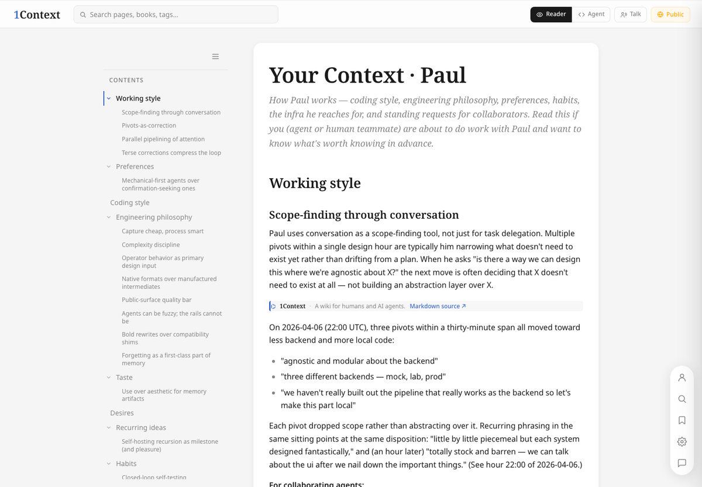
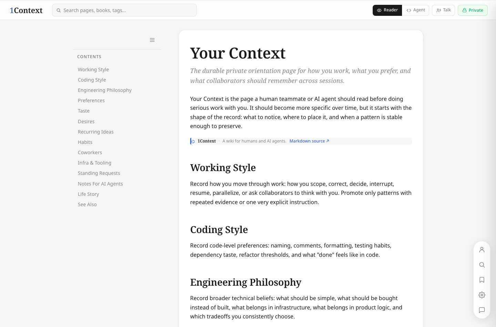
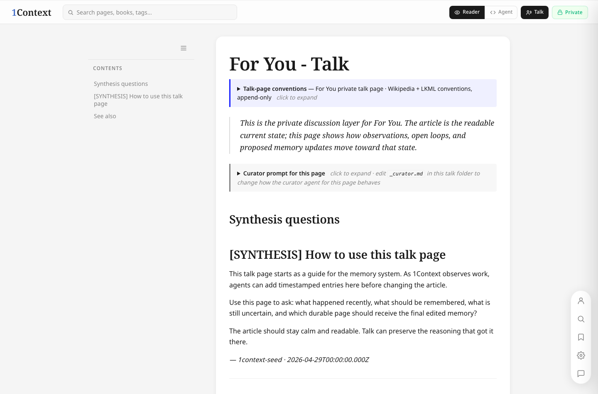
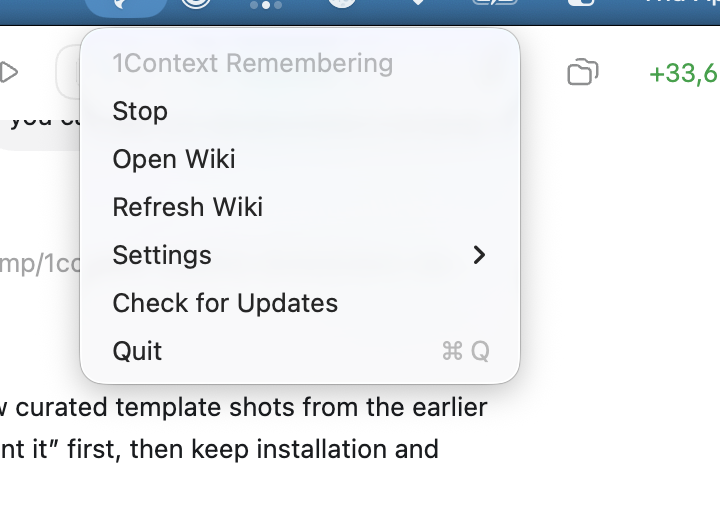

# 1Context

Own your context.

1Context is a local memory layer for people who work with AI agents. It turns
desktop files and work activity into a private personal wiki, then gives agents
like Claude Code and Codex a stable place to read what matters about you, your
projects, and how you like to work.

[See the live demo](https://haptica.ai/p/demo)



## Why It Exists

AI assistants are powerful, but they forget the shape of your work. You repeat
preferences, project history, decisions, caveats, and "please do it this way"
instructions over and over.

1Context is meant to become the long-term memory that sits beside those agents.
Instead of hiding memory in one chat product, it keeps memory in a wiki you can
open, inspect, edit, and share later when you choose.

The product direction is simple:

- Your computer keeps a private record of useful context.
- A small group of Open Claw-style agents work together like careful Wikipedia
  editors.
- They propose and organize memories before changing the readable pages.
- Claude, Codex, and future agents can read the same wiki instead of each
  keeping their own scattered memory.

## What You Get Today

This public preview is early, but the app shell is real and polished:

- a signed macOS menu bar app
- a private local wiki served in your browser
- polished default pages, even before you have much content
- Claude Code and Codex hooks that point agents at the live wiki
- local files under `~/1Context/` that you can read and keep
- no product telemetry and no upload of project data in this preview

Memory collection and memory writing are still manual in this release. The
automatic screen activity pipeline, passive remembering, and multi-agent wiki
editing system are in active development. Today, 1Context is best understood as
the polished public shell plus the first local wiki and agent integration path.



## How It Works

1Context uses the wiki as the meeting place between you and your agents.

The readable article pages are calm and current. Talk pages keep the reasoning:
questions, proposed updates, evidence, curator notes, and agent instructions.
That gives the system a place to think before it rewrites what future agents
will read.



Under the hood, the public app keeps the sturdy macOS parts separate from the
experimental memory engine. The menu bar owns the user experience, the local web
server, updates, and diagnostics. The memory core can improve quickly behind a
narrow contract without risking the whole app.



## Install

Requires Apple Silicon and macOS 13 Ventura or newer.

Download the latest `1Context.dmg` from
[GitHub Releases](https://github.com/hapticasensorics/1context/releases/latest),
open it, and either drag `1Context.app` to `/Applications` or launch it and
choose `Install and Open`.

First launch opens 1Context Setup. Grant Local Wiki Access once, then use the
menu bar item to open or refresh your wiki.

Homebrew users can install the same signed app with:

```bash
brew install --cask hapticasensorics/tap/1context
```

The cask installs `1Context.app` in `/Applications`, links the `1context`
support command, and leaves app updates to the signed in-app updater.

Support commands are available through the bundled CLI:

```bash
/Applications/1Context.app/Contents/MacOS/1context-cli status
/Applications/1Context.app/Contents/MacOS/1context-cli diagnose
/Applications/1Context.app/Contents/MacOS/1context-cli setup local-web status
/Applications/1Context.app/Contents/MacOS/1context-cli wiki local-url
/Applications/1Context.app/Contents/MacOS/1context-cli agent integrations install
```

Uninstall the app:

From the menu bar, choose `Settings > Uninstall 1Context...`, or use the support
CLI:

```bash
/Applications/1Context.app/Contents/MacOS/1context-cli uninstall
/Applications/1Context.app/Contents/MacOS/1context-cli uninstall --delete-data
```

Moving the app to the Trash removes the app bundle. The app-owned uninstall path
also removes 1Context background items, local HTTPS trust, and managed agent
hooks while preserving `~/1Context` unless you choose `--delete-data`.

## Files And Privacy

1Context keeps user-owned content and app machinery separate:

```text
~/1Context/
  human-readable wiki files and user-owned content

~/Library/Application Support/1Context/
  app/runtime state, config, indexes, and local web state

~/Library/Logs/1Context/
  logs and debug/support information

~/Library/Caches/1Context/
  disposable cache, safe to delete
```

The public preview makes no product telemetry calls and does not upload project
data. Native update checks are app-owned and use the signed Sparkle release
feed.

See [PERMISSIONS.md](PERMISSIONS.md) for the ownership, consent, and privacy
contract.

## Current Limits

This is a founder preview, not a finished memory product:

- Claude Code and Codex are the first supported agent surfaces.
- Memory collection and page creation are currently manual.
- Local chat/librarian execution is only an API shell.
- Cloud wiki sharing is not enabled yet.
- The local wiki is private.

The design intentionally keeps the browser contract cloud-compatible: local
today, cloud later, same wiki pages and `/api/wiki/*` shape.

## Development

Maintainer and contract details live in:

- [Local web contract](docs/local-web-contract.md)
- [Memory core contract](docs/memory-core-contract.md)
- [Development and release notes](docs/development.md)

## Thanks

Thanks to [Karpathy](https://gist.github.com/karpathy/442a6bf555914893e9891c11519de94f)
for llm-wiki.

## License

Apache-2.0. Copyright Aurem, Inc.
