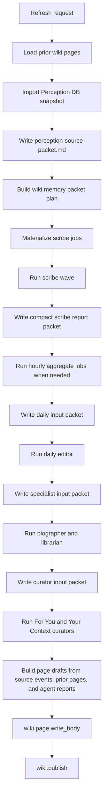
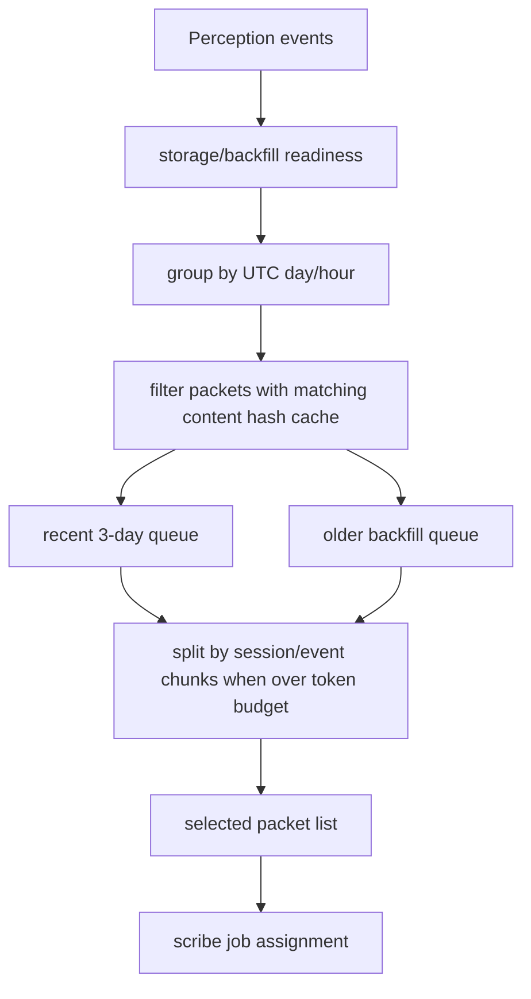
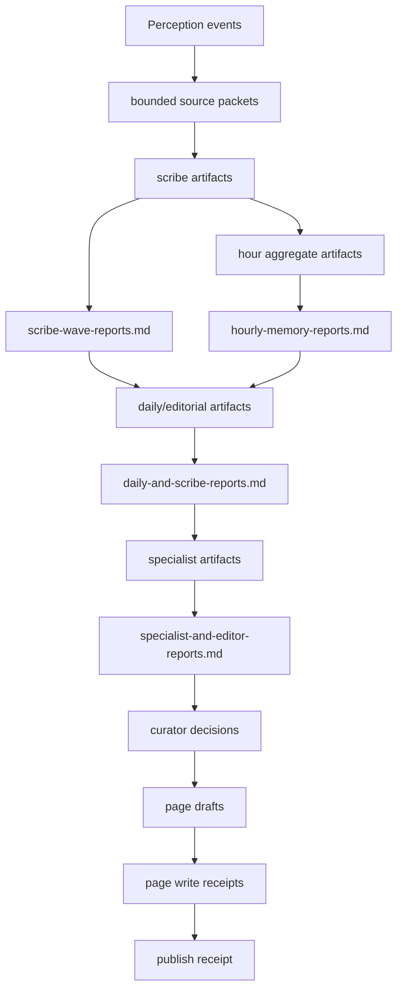
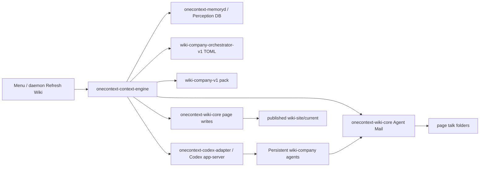
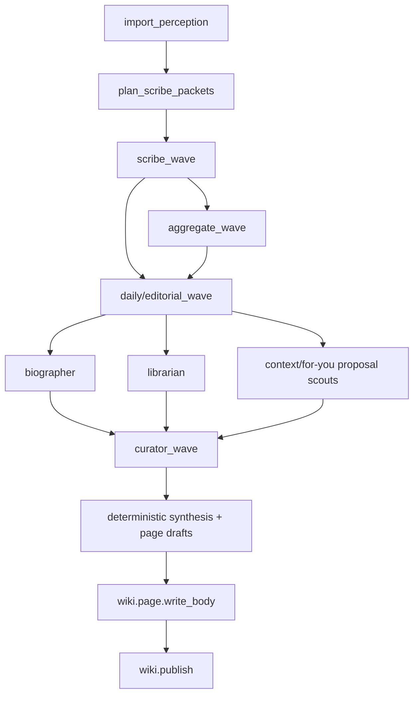
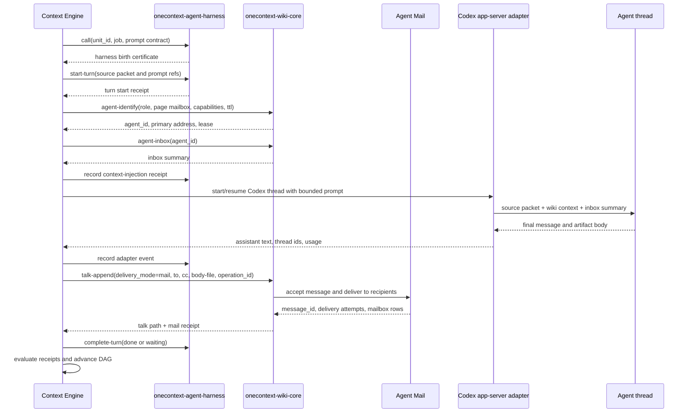
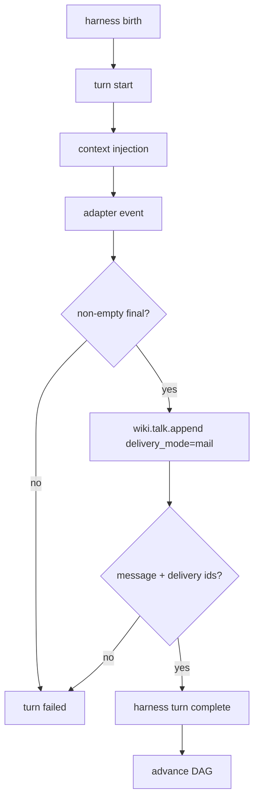
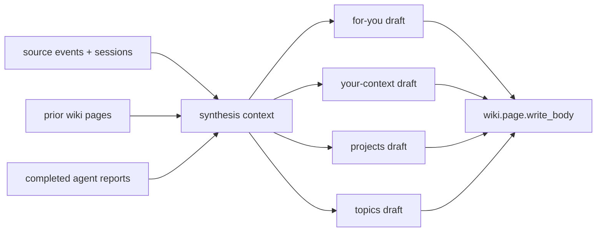
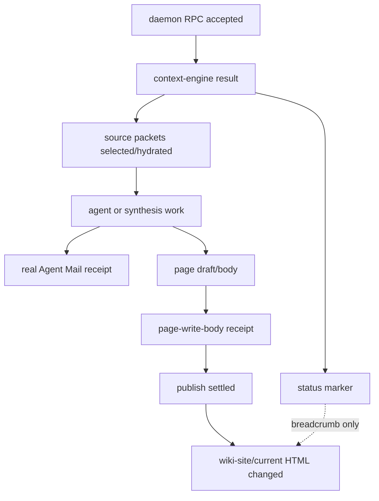

# Context Engine Wiki Company Orchestration Spec

- Status: design contract for the Rust port
- Owner: `onecontext-context-engine`
- Related docs:
  - [Context Engine Release Boundary](context-engine-release-boundary.md)
  - [Context Engine Orchestrator Port Checklist](context-engine-orchestrator-port-checklist.md)
  - [Agent Mail Protocol Spec](agent-mail-protocol.md)
  - [Wiki Publishing System API](wiki-publishing-system-api.md)

This document captures the old Python `memory-core` wiki-company procedure that
made the generated wiki useful, then states the Rust orchestration contract that
must replace it.

The goal is not to preserve Python, `uv`, old harness binaries, or the old
runtime folder shape. The goal is to preserve the product behavior:

1. Refresh Wiki reads recent Perception history and current wiki state.
2. The system compresses raw history into staged memory artifacts.
3. Agents communicate through real Agent Mail and page talk entries.
4. Accepted material becomes fresh wiki source pages.
5. Publishing proves visible wiki output changed.

## Product Bar

A Rust-owned Refresh Wiki run is complete only when it produces product-visible
wiki work:

- Perception source input is bounded, hashed, and associated with the run.
- At least one meaningful source packet is processed when new source history
  exists.
- Agent turns are not counted complete without non-empty final output and real
  talk/mail delivery receipts.
- The daily/editorial layer runs for every refreshed day that has enough scribe
  material.
- Deterministic page synthesis still writes safe page drafts when agents fail or
  partial output is available.
- Page body writes happen through `onecontext-wiki-core` before publish.
- The final installed wiki pages show fresh content, not just a status marker.
- Python `memory-core`, `uv`, and old harness binaries are not on the release
  runtime path.

## Non-Goals

- Do not revive the old Python orchestrator as a release dependency.
- Do not add schema migration scaffolds for old Python run folders.
- Do not make `context-engine/mail/threads/wiki-company.jsonl` pretend to be
  Agent Mail delivery.
- Do not add a broad filesystem `runs/` clone as the permanent rich history
  store. Rich execution history belongs in Postgres/Timescale; Agent Mail is
  the human-readable audit trail.
- Do not make every historical role a standing phase if Rust can replace the
  same behavior with simpler packet planning.

## Current Gap

The current Rust Context Engine is a useful release-boundary proof, but it is
not yet the old wiki company in Rust.

What exists now:

- `onecontext-context-engine update-wiki` runs from the installed app.
- The shipped pack and orchestrator TOML load and validate.
- Prompt bundles can be assembled for Codex app-server turns.
- A small live agent path can write final-message files and JSONL reports.
- The wiki can receive a visible `Context Engine Refresh` status marker.
- The current pack uses `memory.wiki.for_you_editor` where the old system had a
  clearer `memory.daily.editor` layer.

What is missing:

- `phases.toml`, `routing.toml`, `packet-policy.toml`, and `receipts.toml` are
  not yet the live scheduler contract.
- Source packets are not materialized into the agent prompt as real evidence.
- The staged scribe -> aggregate -> daily editor -> specialist -> curator DAG is
  not executed.
- Agent reports are appended to a JSONL file rather than delivered through real
  Agent Mail.
- The marker uses `delivery-mode labels-only`; it is not a mail delivery.
- Page synthesis and `page-write-body` are not part of the Rust refresh path.

The target is not "make the old Python files pass again." The target is "make
the current Rust pack/orchestrator behave like the old company where the old
company was product-significant."

## Current Executable Slice

Rust already owns enough of the release path that the next work should extend
the native path, not rebuild Python around it.

| Surface | Executes today | Not enough yet |
| --- | --- | --- |
| CLI | `onecontext-context-engine describe` and `update-wiki` run from the installed app bundle or local binary | `update-wiki` can report plan/live status without proving page-body changes |
| Pack validation | shipped pack validates providers, harness, agents, jobs, prompt references, and required `codex-app-server` transport | validation does not mean every job is schedulable or live |
| Orchestrator validation | orchestrator files parse and validate ids, phase shape, routing presence, packet policy, and receipt gates | several validated fields are not execution drivers yet |
| Dry run | checks memoryd readiness, builds density-based packet plans, previews harness requests, and reports publish intent | dry run uses density buckets and synthetic source events, not hydrated source packet bodies |
| Live agents | births harness units, starts turns, records adapter events, starts/resumes Codex app-server threads, writes final-message files, and evaluates receipt gates | default live set is only `memory.hourly.scribe` and `memory.wiki.for_you_editor`; execution is not the full DAG |
| Swift integration | menu and daemon call Rust through `ContextEngineProcessClient` for manual and automatic Refresh Wiki | visible app proof is still marker-first rather than page-write-first |
| Wiki marker | creates configured pages and writes a For You talk status marker | marker uses `delivery-mode labels-only`; it is not Agent Mail evidence |

The implementation bar is therefore "turn the validated native slice into a
full product workflow." It is not "prove Rust can call a command."

## Old Python Procedure

The deleted Python `wiki_update.py` file at
`eab09690a43c56f8366bd72e8a67041acfd5f742` is the main reference for the old
procedure. Current surviving helpers remain in:

- `memory-core/src/onectx/memory/jobs.py`
- `memory-core/src/onectx/memory/wiki_synthesis.py`
- `memory-core/src/onectx/memory/day_hourlies.py`
- `memory-core/src/onectx/memory/for_you_runner.py`

The old flow had four important properties:

1. It built a real source packet from Perception history and prior wiki pages.
2. It ran a staged agent company, passing compact artifacts downstream.
3. It posted agent reports through wiki talk plus Agent Mail.
4. It always ran deterministic page synthesis and page writes after the agent
   wave.

### Python Phase Shape



The exact historical phase labels changed over the branch, but the durable
shape did not: raw history is compressed before editorial work, editorial work
feeds specialists, specialists feed curators, and deterministic synthesis writes
page bodies as a safety net.

### Source Packet Contract

The old source packet was not a placeholder. It carried:

- source store and import status
- source list
- window days
- event/session counts
- cursor name
- recent session evidence
- current/prior wiki page snapshot
- per-packet metadata when a packet plan existed

For packet-planned runs, each selected packet carried:

- `packet_id`
- `date`
- `hour`
- `source_packet_path`
- `source_packet_kind`
- source event/session counts
- estimated tokens
- target token budget
- content hash
- cache path

Rust must preserve this semantic contract even if the physical storage changes.
Every agent turn must know exactly which bounded source packet it is
responsible for, and downstream agents must read compact artifact packets rather
than raw transcript history.

### Packet Planning, Cursors, And Progress

Packet planning has two separate progress cursors:

- `raw_ingest_cursor`: where source import stopped reading native transcript
  history.
- `wiki_memory_cursor`: where the wiki memory company stopped processing
  bounded packets and downstream artifacts.

Those cursors must advance independently. A retry should resume at the missing
packet, hour, or day rather than restarting a whole backfill. Cache hits are
keyed by source packet content hash, not only by date/hour labels.

The default policy remains:

- first visible progress: 15-60 seconds after a manual refresh
- first agent output: 1-3 minutes when model transport is healthy
- first useful wiki page: 3-8 minutes for a small recent window
- initial backfill window: 30 days
- catch-up selection: recent 3 days first, then older packets oldest-to-newest
- default usable context: about 258,400 tokens
- default scribe source fraction: 0.62, or about 160k source tokens
- default max selected scribe packets per run: 20



Only raw-history roles may receive transcript packets. In the current
orchestrator, that means the scribe phase. Editors, specialists, curators, and
page writers consume scribe artifacts, aggregate artifacts, talk/mail context,
and prior wiki page bodies.

### Artifact Chain

The old runtime produced logical artifacts like these:

```text
perception-source-packet.md
source-packets/<packet>.md
scribe-artifacts/<date>T<hour>-<packet>.md
scribe-wave-reports.md
hour-aggregate-artifacts/<date>T<hour>.md
hourly-memory-reports.md
daily-artifacts/<date>.md
daily-and-scribe-reports.md
specialist-artifacts/<role>.md
specialist-and-editor-reports.md
page-drafts/for-you.md
page-drafts/your-context.md
page-drafts/projects.md
page-drafts/topics.md
wiki-synthesis.json
update.json
```

Rust does not have to recreate this exact folder tree. It does have to preserve
the data products and handoff points:

- raw source packet
- scribe artifact
- compact scribe report packet
- aggregate artifact
- daily editor artifact
- specialist artifact
- curator decision artifact
- page draft
- page write receipt
- publish receipt

Where those live should be explicit:

- accepted wiki memory lives in `user-wiki/source`
- talk/mail audit lives in Agent Mail and page talk folders
- rich execution history lives in Postgres/Timescale when available
- temporary prompt inputs may live in a run scratch directory, but scratch is
  not the product source of truth



## Rust Target Architecture



`onecontext-context-engine` owns scheduling and evidence flow. `onecontext-wiki-core`
owns page lifecycle, talk append, Agent Mail delivery, and publish. The Codex
adapter owns model transport. The agents own judgment inside bounded turns.

## Executable TOML Contract

The TOML files are not documentation once this spec is implemented. They are
the run contract.

| File | Rust must use it for |
| --- | --- |
| `orchestrator.toml` | active pack, harness, max concurrency policy, model policy, execution-history mode |
| `phases.toml` | DAG nodes, owners, dependencies, durable outputs, raw-history access |
| `packet-policy.toml` | source window, recent-first/backfill behavior, token budget, split policy, cache behavior |
| `routing.toml` | all Agent Mail `to` and `cc` routing, including page mailboxes |
| `receipts.toml` | completion gates; a run or turn fails if required receipts are missing |
| `packs/*/agents/*.toml` | role identity, model/reasoning policy, prompt stack |
| `packs/*/jobs/*.toml` | typed inputs, outputs, permissions, done/failure conditions |
| `packs/*/harnesses/*.toml` | transport, required tools, prompt-control options, receipt fields |

Hardcoded Rust defaults are allowed only as bootstrapping defaults. When a TOML
field exists and validates, Rust should either execute it or report that it is
not implemented.

### Config Execution Status

Until the port is complete, the implementation must keep a hard distinction
between config that is validated and config that controls behavior.

| Contract | Current status | Required behavior |
| --- | --- | --- |
| `routing.toml` | parsed and validated; live routes are still hardcoded in Rust | route every talk/mail report, page proposal, and curator decision from TOML |
| `packet-policy.toml` | parsed; dry-run mostly uses Rust defaults plus requested window | drive packet budget, split policy, cache behavior, recent-first/backfill order, and raw-history access |
| `receipts.toml` | parsed; turn receipts are assembled by hardcoded harness request logic | provide the executable completion gate for every phase and job |
| `phases.toml` | parsed and counted; tiny live execution selects a fixed job subset | schedule the DAG, dependencies, retries, no-op states, cache skips, and max concurrency |
| harness TOML | id, runner, command, tools, captures, and prompt control are consumed | make runtime sequence, tool gateway, proof fields, and permissions enforceable |
| `linking.toml` / `native-memory.toml` | surfaced as pack paths | either execute the policy or report `not_implemented` explicitly |

## Orchestration DAG



### Phase Contracts

| Phase | Inputs | Outputs | Done only when |
| --- | --- | --- | --- |
| `import_perception` | request, source window, cursor | source snapshot summary, source event handles | memoryd status is `ok` or a typed no-source result exists |
| `plan_scribe_packets` | source snapshot, `packet-policy.toml`, packet cache | bounded packet list, cache hits/misses | every selected packet has id, hash, event count, token estimate |
| `scribe_wave` | selected packets, hourly scribe prompt, current wiki context | scribe artifacts and mail/talk reports | every selected packet is completed, skipped-cached, or failed with receipt |
| `aggregate_wave` | multiple same-hour scribe artifacts | one canonical hourly artifact per oversized/split hour | aggregate entry validates or phase records no-aggregate-needed |
| `daily/editorial_wave` | daily scribe/aggregate artifacts, For You talk/page context | daily memory artifact/proposal | every day with scribe material has editor output or typed no-op |
| `specialist_wave` | daily artifacts, page context, concept context | biographer/librarian/specialist proposals | specialist reports are delivered through mail/talk |
| `curator_wave` | specialist/editor proposals, current page body, talk/mail history | accepted/rejected page decisions | curators write decisions and accepted page patches/drafts |
| `synthesis` | source events, prior pages, agent reports | page drafts for core pages | drafts exist for `for-you`, `your-context`, `projects`, `topics` |
| `page_write` | page drafts, source hashes | wiki-core write receipts | `page-write-body` succeeds or produces repairable conflict |
| `publish` | updated user-wiki source | publish evidence | visible site is promoted and validation passes |

## Role Contract

### Required Standing Roles

| Role | Purpose | Reads raw history? | Writes |
| --- | --- | --- | --- |
| hourly scribe | summarize bounded packet/hour into talk-ready memory | yes | scribe artifact, mail/talk report |
| hourly aggregate scribe | combine split same-hour notes into one canonical hourly note | no | aggregate artifact, mail/talk report |
| daily editor | turn a day of scribe memory into coherent daily memory | no | daily artifact/proposal, mail/talk report |
| For You editor | prepare page-level For You proposals from scribe/daily/specialist material | no | editorial artifact, mail/talk report |
| biographer | produce cross-day cover-story/trajectory proposals | no | specialist artifact, mail/talk report |
| librarian | create/expand/prune concept/project/topic proposals | no | specialist artifact, mail/talk report |
| context curator | decide accepted Your Context changes | no | page decision and page draft/patch |
| For You curator | decide accepted For You changes | no | page decision and page draft/patch |
| redactor | propose privacy tier changes or redactions | no | redaction proposal and talk/mail report |
| contradiction flagger | find stale/conflicting claims | no | contradiction talk/mail entries |

### Conditional Roles

The shipped Rust pack may implement the old daily editor as
`memory.wiki.for_you_editor` while the port is in flight, but the orchestration
contract must preserve the layer as a daily input/output boundary. If naming the
old role directly avoids confusion, re-add `memory.daily.editor` as an explicit
job and route the For You editor after it.

`hourly shard scribe` should be conditional, not a standing phase. It exists for
oversized hour/packet inputs that exceed prompt budget after packet planning. If
Rust can split source packets mechanically and run normal hourly scribes, do
that. If an individual hour still needs intra-hour witness notes, run shard
scribes and then require an aggregate scribe before the hour can feed daily
editor work.

`source packet shard` and `source packet aggregate` are also conditional. They
are useful when a page proposal source packet is too large for one specialist or
curator turn. They should not replace the normal scribe/daily/specialist flow.

## Agent Turn Lifecycle

Every model-backed job follows this lifecycle:



The important rule: a file path to `wiki-company.jsonl` is not a mail receipt.
A valid mail receipt must come from the wiki-core/Agent Mail delivery path and
include enough information to identify message acceptance and delivery state.



### Required Turn Receipts

Each agent turn must produce:

- harness birth certificate
- harness turn-start receipt
- agent identity receipt
- inbox/context injection receipt
- model transport receipt
- non-empty final message
- artifact body or typed `<no-op>` body
- `wiki.talk.append` receipt
- Agent Mail acceptance/delivery receipt
- harness turn completion receipt
- next-state declaration

`codex` exit status alone never completes a turn. A synthesized final message
like "No assistant text captured" is a failure artifact, not a completion
receipt.

## Real Agent Mail Contract

The Rust Context Engine must use the existing mail kernel, not a parallel log.

Real mail storage is owned by `onecontext-wiki-core` under
`<1Context>/context-engine`:

- `agents/directory/*.jsonl` for identities and leases
- `mail/messages.jsonl` and `mail/bodies/` for immutable message truth
- `mail/deliveries.jsonl`, `mail/claims.jsonl`, and mailbox indexes for
  recipient state
- `mail/injection-receipts.jsonl` for body/context injection into a worker
  transport
- `notifications/outbox.jsonl` and `notifications/attempts.jsonl` for wakeup
  attempts

`wiki.talk.append` is the bridge from page discussion to delivery. It defaults
to labels-only metadata; only explicit `delivery_mode=mail` creates Agent Mail
messages, delivery rows, mailbox state, and notifications.

For each run:

1. Register or renew the context-engine runner identity.
2. Register or renew each agent identity with role addresses and page mailbox
   grants.
3. Send initial work either as a mail message or as a direct harness prompt that
   is also recorded as mail/talk context.
4. Before a turn acts on routed work, read the agent inbox.
5. Deliver final reports through `wiki.talk.append` with `delivery_mode=mail`.
6. Use `routing.toml` for `to` and `cc`.
7. Use stable `operation_id` values for idempotent retries.
8. Require wiki-core mail receipts for completion.

### Valid Mail Receipt Shape

A completion receipt must come from `onecontext-wiki-core` Agent Mail, not from
`context-engine/mail/threads/wiki-company.jsonl`.

For final reports delivered through `wiki.talk.append`, the receipt must prove:

- `delivery_mode=mail`
- stable `operation_id`
- talk append result status
- `message_id` and `thread_id`
- `mail_delivery.status`
- mail acceptance status
- at least one delivery attempt with `recipient`, `delivery_id`, and delivery
  status for each required route

When a worker consumes routed mail before acting, the evidence must also include:

- `wiki.agent.identify` result with `agent_id`, primary address, granted roles,
  granted page mailboxes, granted capabilities, and lease
- `wiki.agent.inbox` result used to build the prompt context
- `wiki.mail.open` result for the delivery body or a typed no-mail result
- `wiki.mail.record_injection` result with `injection_id`, `delivery_id`,
  `message_id`, `agent_id`, `thread_id`, `body_sha256`,
  `app_server_method`, and `app_server_result`
- `wiki.mail.claim` and terminal `wiki.mail.mark done`, `archived`, or
  `rejected` when the delivery represents worker-owned routed work

The JSONL wiki-company thread may remain as a readable audit mirror. It cannot
be the receipt of record, and it cannot satisfy `receipts.toml`.

For page-local decisions:

- page proposals go to the relevant curator role and `mailbox://page/<page-id>`
- curator decisions stay in the page talk/mail trail
- accepted page body changes go through `wiki.page.write_body` or
  `wiki.page.patch_body`
- mail read/claim/mark state does not require publish

## Deterministic Synthesis Safety Net

The old system was impressive partly because it did not depend on every agent
turn succeeding. After execution, it still built page drafts from:

- meaningful source events
- meaningful source sessions
- current/prior page bodies
- completed agent reports
- artifact bodies

Rust needs the same safety net.



The deterministic layer should be conservative. It may update status sections,
recent work summaries, project/topic indexes, and citations. It should not
silently accept contested curator decisions. Agent judgment is still required
for durable personal claims, contradiction resolution, privacy decisions, and
large page rewrites.

This layer must not hide agent failure. A run can have `write_or_patch_wiki`
and `publish` complete while the overall update status stays failed because an
agent turn failed. That distinction is product truth: the wiki may still get a
safe refresh, but the company did not fully complete.

## Page Write And Publish Contract

After synthesis and curator decisions:

1. Ensure configured pages exist with `page-create-all`.
2. Read current page status/source hashes.
3. Write accepted drafts through `page-write-body` or patch through
   `page-patch-body` with hash preconditions when available.
4. Record page write receipts with page id, old hash, new hash, source path,
   operation id, and conflict status.
5. Publish through `wiki.publish`.
6. Verify the visible installed wiki changed when source content changed.

`Context Engine Refresh` status talk entries are useful breadcrumbs, but they do
not satisfy page write completion.

## Installed-App Proof Chain

The installed app proof must show the full chain, not only RPC acceptance.



The marker path can help diagnose a run, but the proof is not complete until
mail, page-write, publish, and visible-page evidence all agree.

## Run State And Proof Semantics

The old Python system wrote `update.json`, `wiki-synthesis.json`, tick cycle
state, job results, and per-artifact receipts. Rust does not need to preserve
those filenames, but it must preserve the proof semantics.

Every refresh result should expose:

- request identity: run id, trigger, source window, execute-agents flag, max
  concurrency, mode
- source state: import status, cursor, event/session counts, selected packet
  count, skipped/cache count
- phase state: planned, running, completed, failed, skipped, no-op
- job state: role, job id, source packet ids, input artifact ids, output artifact
  ids, model transport ids, duration, completion status
- mail state: agent ids, message ids, delivery ids, injection ids, claim/mark
  ids where applicable
- wiki state: page ids, write operation ids, old/new hashes, publish id, visible
  site path
- failure state: typed error, retry idempotency key, operator-visible repair hint

The app-facing response can stay compact, but the proof bundle must let a human
answer: what source was read, which agents acted, which mail was delivered,
which pages changed, and why any phase did not complete.

## Failure Semantics

Failures should be explicit and product-visible without corrupting wiki truth.

| Failure | Result |
| --- | --- |
| memoryd unavailable | no-source run may publish only status/repair note; no agent raw-history turns |
| empty source window | typed no-op with mail/talk status and no page rewrite requirement |
| packet too large | split by policy; shard scribe only if mechanical split is insufficient |
| agent returns no text | turn failed; do not count as completion |
| talk append succeeds but mail delivery fails | talk entry remains; phase waits or retries with same operation id |
| page write hash conflict | curator/synthesis output preserved as proposal; no overwrite |
| publish fails | source remains updated; site/current remains last good publish |

## Product Acceptance Criteria

The first faithful Rust implementation is accepted when an installed dev app
manual Refresh Wiki over a 3-day window can show:

- `context_engine.update_wiki` response reports `status=completed`.
- `memory_core_release_status=not_on_release_path`.
- Perception source status is `ok` or typed no-source.
- Selected packet count is non-zero when new meaningful source history exists.
- The daily/editorial layer ran for each refreshed day with scribe material.
- At least one report was delivered through Agent Mail with real message and
  delivery identifiers.
- Routed worker mail has injection, claim, and terminal mark evidence when the
  worker acts on mail-delivered context.
- No `context-engine/mail/threads/wiki-company.jsonl` path is accepted as the
  mail receipt of record.
- At least one page body write happened when source content changed.
- Published `for-you`, `your-context`, `projects`, or `topics` content reflects
  the refreshed source window.
- No turn with "No assistant text captured" is counted complete.
- The proof bundle includes source counts, packet ids, mail receipts, page write
  receipts, publish evidence, and visible page paths.

## Implementation Order

1. Replace JSONL-only mail receipts with wiki-core Agent Mail delivery,
   including identity, inbox, open, injection, claim, and mark receipts.
2. Make `receipts.toml` executable: fail completion without real receipts.
3. Materialize source packets from Perception DB and current wiki pages.
4. Port deterministic synthesis and page write logic into Rust.
5. Preserve the old daily-editor layer. Prefer re-adding an explicit
   `memory.daily.editor` job if it makes the DAG clearer; otherwise make
   `memory.wiki.for_you_editor` carry the same daily input/output contract.
6. Make `packet-policy.toml` drive Rust packet planning.
7. Make `phases.toml` and `routing.toml` drive the scheduler.
8. Implement staged artifact handoff: scribe, aggregate, daily, specialist,
   curator, synthesis.
9. Add conditional shard/source-packet helper roles only for oversized packets.
10. Promote rich execution history into Postgres/Timescale instead of reviving
    Python run folders.

## Reference Pointers

- Old Python phase and run entry:
  `git show eab09690a43c56f8366bd72e8a67041acfd5f742:memory-core/src/onectx/memory/wiki_update.py`
  around lines 145-321.
- Old packet planner, cursors, context budget, selection strategy, and source
  packet rendering:
  `git show eab09690a43c56f8366bd72e8a67041acfd5f742:memory-core/src/onectx/memory/wiki_memory_plan.py`
  around lines 16-20, 58-80, 110-198, 201-318, and 321-363.
- Old source packet construction:
  same historical file around lines 324-405.
- Old staged wave execution:
  same historical file around lines 524-845.
- Old harness/mail/talk append execution:
  same historical file around lines 950-1259 and 1479-1714.
- Old report extraction for synthesis:
  same historical file around lines 1278-1313.
- Current job preparation helpers:
  `memory-core/src/onectx/memory/jobs.py`.
- Current deterministic synthesis helper:
  `memory-core/src/onectx/memory/wiki_synthesis.py`.
- Current month/hour split and aggregate helper:
  `memory-core/src/onectx/memory/day_hourlies.py`.
- Current Rust Context Engine crate:
  `crates/onecontext-context-engine`.
- Current Rust packet planner:
  `crates/onecontext-context-engine/src/packet_planner.rs` lines 11-15 and
  92-188.
- Current Rust harness request and completion gate:
  `crates/onecontext-context-engine/src/harness_executor.rs` lines 151-262 and
  282-348.
- Current Rust pack/orchestrator policy files:
  `runtime/1Context/context-engine/packs/wiki-company-v1/` and
  `runtime/1Context/context-engine/orchestrators/wiki-company-orchestrator-v1/`.
- Current real Agent Mail implementation:
  `crates/onecontext-wiki-core/src/agent_mail.rs`.
