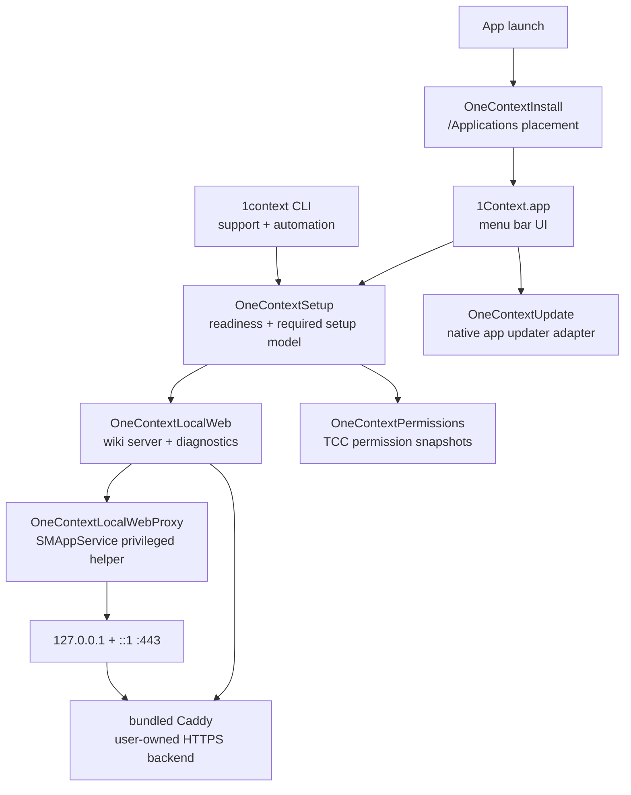
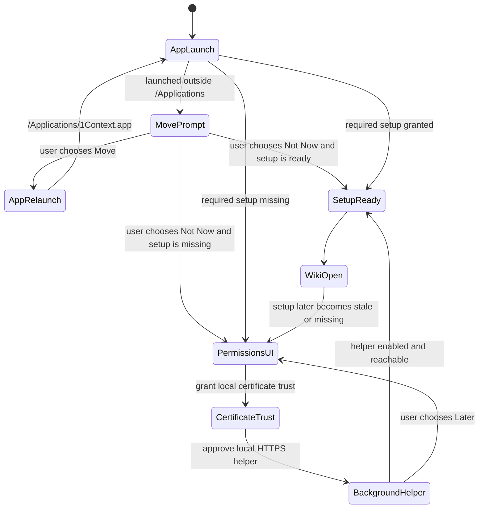

# macOS App Architecture

1Context is a signed macOS app first. The CLI is a support surface, not the product's setup path. Setup, permissions, update, and the local wiki should therefore be modeled as app-owned capabilities with small infrastructure helpers underneath them.

## Current Direction

## Source Boundaries

- `OneContextMenuBar`: owns user-facing setup prompts, permissions UI, update UI, and opening the wiki.
- `OneContextInstall`: owns app placement decisions and moving/relaunching into `/Applications` before setup, update, or runtime chores run.
- `OneContextSetup`: owns the app-level readiness and setup model. It answers “can the required app experience work?” without knowing about AppKit.
- `OneContextPermissions`: owns macOS privacy permission snapshots such as Screen Recording and Accessibility.
- `OneContextLocalWeb`: owns Caddy configuration, local HTTPS diagnostics, certificate trust installation, and ServiceManagement registration.
- `OneContextLocalWebProxy`: stays intentionally tiny. It only binds the privileged local HTTPS port and forwards bytes to the user-owned Caddy backend.
- `OneContextUpdate`: owns native app update state. Sparkle can land behind this boundary without changing menu or CLI callers.
- `OneContextCLI`: supports diagnostics, automation, and repair. It should route users back to the app-owned permissions/setup surface when required setup is missing.

## Setup Policy

The required launch gate is Local Wiki Access because the app's primary wiki URL is `https://wiki.1context.localhost/your-context`. Future sensitive permissions, such as Screen Recording and Accessibility, should be added to `OneContextPermissions` and surfaced through `OneContextSetup` before feature code depends on them.

## Smoke Policy

The deterministic release smoke test keeps using high-port HTTP because it must run in CI without modifying the machine. Product HTTPS gets a separate opt-in smoke test because it intentionally touches macOS user trust and background item approval.
