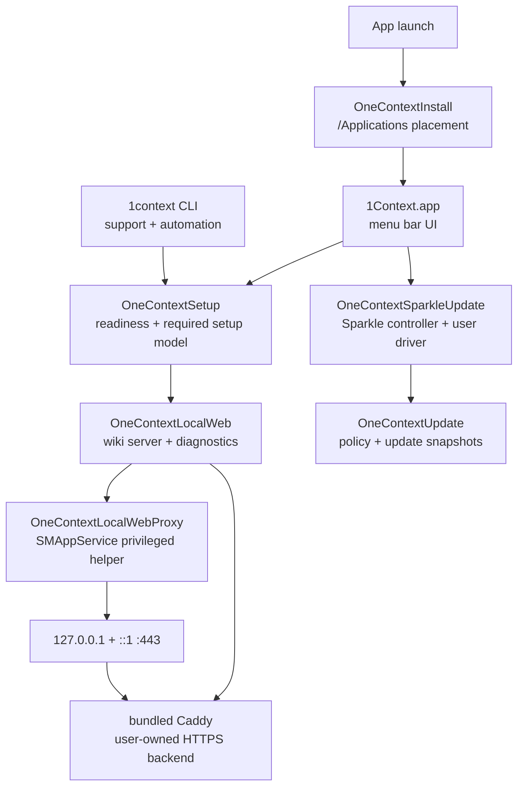
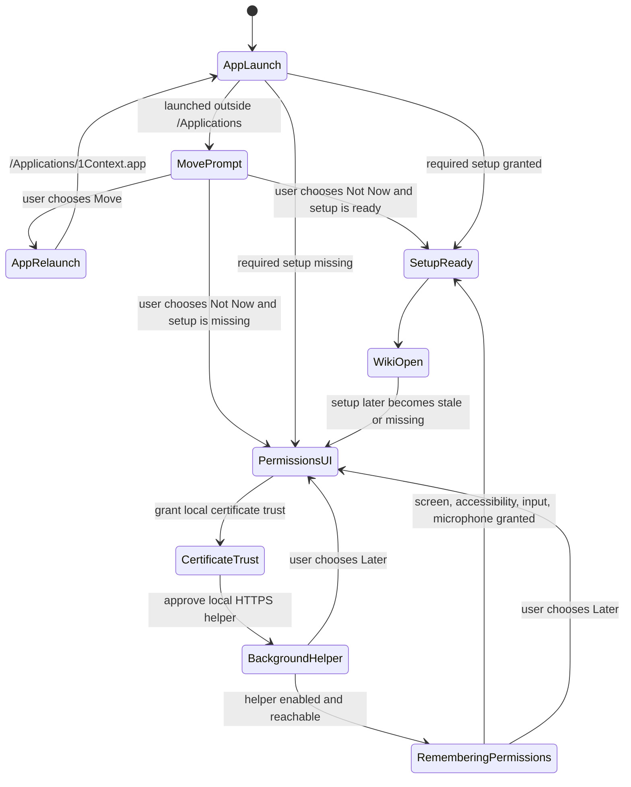

# macOS App Architecture

1Context is a signed macOS app first. The CLI is a support surface, not the product's setup path. Setup, update, and the local wiki should therefore be modeled as app-owned capabilities with small infrastructure helpers underneath them.

## Current Direction


```mermaid
flowchart TD
  AppLaunch["App launch"] --> Install["OneContextInstall\n/Applications placement"]
  Install --> App["1Context.app\nmenu bar UI"]
  App["1Context.app\nmenu bar UI"] --> Setup["OneContextSetup\nreadiness + required setup model"]
  CLI["1context CLI\nsupport + automation"] --> Setup
  Setup --> LocalWeb["OneContextLocalWeb\nwiki server + diagnostics"]
  App --> SparkleUpdate["OneContextSparkleUpdate\nSparkle controller + user driver"]
  SparkleUpdate --> Update["OneContextUpdate\npolicy + update snapshots"]
  LocalWeb --> Caddy["bundled Caddy\nuser-owned HTTPS backend"]
  LocalWeb --> Proxy["OneContextLocalWebProxy\nSMAppService privileged helper"]
  Proxy --> Port443["127.0.0.1 + ::1 :443"]
  Port443 --> Caddy
```

## Source Boundaries

- `OneContextMenuBar`: owns user-facing setup prompts, update UI, and opening the wiki.
- `OneContextInstall`: owns app placement decisions and moving/relaunching into `/Applications` before setup, update, or runtime chores run.
- `OneContextSetup`: owns the app-level readiness and setup model, including required remembering permission preflight and request calls. It answers “can the required app experience work?” without owning AppKit UI.
- `OneContextLocalWeb`: owns Caddy configuration, local HTTPS diagnostics, certificate trust installation, and ServiceManagement registration.
- `OneContextLocalWebProxy`: stays intentionally tiny. It only binds the privileged local HTTPS port and forwards bytes to the user-owned Caddy backend.
- `OneContextUpdate`: owns update policy parsing, appcast configuration snapshots, user-facing update strings, post-install message gates, and CLI-readable update diagnostics.
- `OneContextSparkleUpdate`: owns the Sparkle framework controller and user driver used by the menu app. Mandatory/optional behavior lives here, backed by the policy values from `OneContextUpdate`.
- `OneContextCLI`: supports diagnostics, automation, and repair. It should route users back to the app-owned setup surface when required setup is missing.

## Setup Policy


```mermaid
stateDiagram-v2
  [*] --> AppLaunch
  AppLaunch --> MovePrompt: launched outside /Applications
  MovePrompt --> AppRelaunch: user chooses Move
  AppRelaunch --> AppLaunch: /Applications/1Context.app
  MovePrompt --> SetupReady: user chooses Not Now and setup is ready
  MovePrompt --> PermissionsUI: user chooses Not Now and setup is missing
  AppLaunch --> SetupReady: required setup granted
  AppLaunch --> PermissionsUI: required setup missing
  PermissionsUI --> CertificateTrust: grant local certificate trust
  CertificateTrust --> BackgroundHelper: approve local HTTPS helper
  BackgroundHelper --> RememberingPermissions: helper enabled and reachable
  RememberingPermissions --> SetupReady: screen, accessibility, input, microphone granted
  RememberingPermissions --> PermissionsUI: user chooses Later
  BackgroundHelper --> PermissionsUI: user chooses Later
  SetupReady --> WikiOpen
  WikiOpen --> PermissionsUI: setup later becomes stale or missing
```

The required launch gate is 1Context Setup: Local Wiki Access plus the full
remembering permission inventory. The app can preflight the native grants
directly today: Screen & System Audio Recording, Accessibility, Input Monitoring,
and Microphone. The app's primary wiki URL is `https://localhost/your-context`;
the branded alias
`https://wiki.1context.localhost/your-context` is served for diagnostics and
compatibility observation, but the app does not depend on it for readiness or
browser-open behavior.

Those permissions map to separate capture lanes:

```text
Screen & System Audio Recording  pixels, display truth, window evidence, optional system audio
Accessibility                    focused app/window, UI semantics, titles, controls
Input Monitoring                 coarse UX anchors: click, scroll, focus, command timing
Browser extension permissions    URL, tab, DOM, selected text, scroll position, page metadata
Microphone                       spoken context when audio remembering is enabled
Automation                       app-specific Apple Events for direct source context/control
Full Disk Access                 session logs, Messages, browser history, app databases
```

Input Monitoring is required for the event lane, not as a raw keystroke memory
source. Raw typed text should come from higher-signal app, browser, terminal, AX,
or OCR channels unless an explicit feature changes that policy.

Browser extension permissions, Automation, and Full Disk Access are part of the
same 1Context Setup page. They are not one global macOS preflight, so their Grant
actions launch the browser extension install/permission prompt, per-target
Automation request, or Full Disk Access settings prompt from that page. The user
experiences this as one product setup flow, not a set of separate subsystems.

The setup UI treats green state as a signed-app proof, not merely a Settings
toggle or a remembered boolean. Input Monitoring follows the IOHID
listen-event gate that macOS surfaces in Privacy & Security > Input Monitoring,
then stores proof only after the signed app can preflight that grant. Screen &
System Audio Recording requires ScreenCaptureKit pixel proof and a system-audio
stream proof. Browser extension setup requires an extension-to-app proof
containing the extension id, version, granted permissions, and host permissions.
Automation is checked per configured Apple Events target instead of using
Finder as a global proxy or silently requiring every installed app in the
catalog. Full Disk Access is confirmed by reading every existing protected
probe path in the current inventory from the process that owns the protected
reads.

## Smoke Policy

The deterministic smoke tests no longer use a developer-port local-web mode.
They prove runtime policy and diagnostics without pretending setup is complete;
real local HTTPS behavior belongs to setup tests and the self-hosted release
proof.
