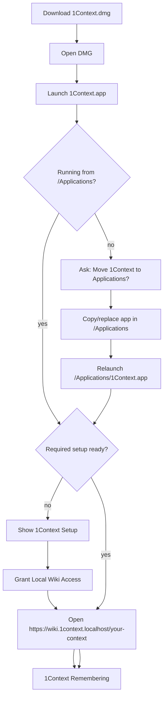

# Milestone: App-Owned macOS Install and Distribution

## Goal

1Context should install like a first-class macOS app: a user downloads a signed
release, opens it, ends up running `/Applications/1Context.app`, grants required
setup in the app, and later receives verified app-owned updates. The raw app
bundle can remain useful for local development, but the product path should not
depend on package-manager scripts, Terminal scripts, or manual file placement.

This milestone combines two distribution surfaces:

- A DMG as the normal downloadable release container.
- A self-moving first-launch flow so `1Context.app` can move itself to
  `/Applications` when launched from Downloads, a DMG, or a build folder.

## Done When

- A release build produces a signed `1Context.app`, a `.dmg`, and any required
  update feed artifacts from one command.
- Opening the DMG presents only the product install surface: `1Context.app` and
  an Applications destination.
- Launching `1Context.app` outside `/Applications` asks to move it there,
  performs the move, relaunches from `/Applications`, and removes or ignores the
  transient copy.
- If `/Applications/1Context.app` already exists, the app handles replace,
  cancel, older-version, same-version, and newer-version cases deliberately.
- First launch from `/Applications` opens the setup window when required local
  wiki access is missing or stale.
- Setup status is visible in the menu bar, CLI status, diagnose output, and the
  setup window.
- The update path assumes `/Applications/1Context.app` and uses Sparkle.
- Automated smoke tests prove the DMG contents, first-launch install decision
  model, setup gating, and local wiki availability.
- Manual clean-machine evidence exists for DMG open, app move, setup grant,
  wiki open, relaunch, update, and uninstall cleanup.

## Flow

## Checklist

### 1. Current Baseline

- [x] Release packaging builds `dist/1Context.app`.
  Evidence: `scripts/package-macos-release.sh`.
- [x] Release packaging validates the product DMG before publishing.
  Evidence: `scripts/validate-macos-dmg.sh`.
- [x] The app owns required local wiki setup on first launch and repair.
  Evidence: `AppSetupWindowController` and local web setup flow in
  `macos/Sources/OneContextMenuBar/main.swift`.
- [x] Required setup is observable from CLI permissions output.
  Evidence: `1context permissions`.
- [x] Runtime health can report required setup state.
  Evidence: `RuntimeHealth.requiredSetupReady` and
  `RuntimeHealth.requiredSetupSummary`.
- [x] Menu, daemon, and CLI share one app readiness contract.
  Evidence: `OneContextAppReadiness` feeds setup, health, diagnose, and launch
  gating.
- [x] Release packaging produces a DMG.
  Evidence: `scripts/package-macos-release.sh` produced
  `dist/1Context-<version>-macos-arm64.dmg`.
- [x] Release validation inspects the DMG contents.
  Evidence: `scripts/validate-macos-dmg.sh`.

### 2. DMG Release Container

- [x] Add a deterministic DMG builder script using first-party macOS tools.
  Proof: `scripts/create-macos-dmg.sh` creates `dist/1Context-<version>-macos-<arch>.dmg`.
- [x] DMG contents are minimal and product-shaped.
  Proof: mounted DMG contains `1Context.app` and an `Applications` symlink.
- [x] DMG creation is included in `scripts/package-macos-release.sh`.
  Proof: package output prints the `.dmg` path.
- [x] DMG validation mounts read-only, verifies app identity, verifies
  executable paths, and detaches cleanly.
  Proof: release validation or a dedicated DMG smoke script.
- [x] Notarized builds staple the app and the DMG.
  Proof: `v0.1.51` release packaging passed `spctl` and `stapler validate` for
  both `dist/1Context.app` and `dist/1Context-0.1.51-macos-arm64.dmg`.
- [x] Local unnotarized builds remain possible for development.
  Proof: `ALLOW_UNNOTARIZED=1 NOTARIZE=0 ./scripts/package-macos-release.sh` passes.

### 3. Self-Moving First Launch

- [x] Add an app install coordinator module with no menu-specific UI assumptions.
  Proof: `OneContextInstall` target and `OneContextInstallTests`.
- [x] Detect whether the current bundle is already in `/Applications`.
  Proof: unit tests cover `/Applications`, `/Users/.../Downloads`, mounted DMG,
  and translocated-style paths.
- [x] Before normal launch chores, ask the user to move the app when launched
  outside `/Applications`.
  Proof: `AppDelegate.handleAppInstallAtLaunch()` runs before menu, setup,
  updater, local web, or runtime startup chores.
- [x] Copy with `FileManager`/`ditto` semantics that preserve bundle structure,
  signatures, resources, helper tools, and executable bits.
  Proof: `testMoverCopiesBundleAndReplacesExistingApp`.
- [x] Handle existing `/Applications/1Context.app`.
  Proof: tests cover no existing app, same version, older version, and newer
  version.
- [ ] Handle non-writable destination and running destination app cases.
  Proof: harnesses cover standard-user permissions and already-running installed
  app replacement.
- [x] Relaunch from `/Applications/1Context.app` after a successful move.
  Proof: `AppInstallMover.relaunch(destinationBundleURL:)`.
- [ ] If moving fails, explain the next action without blocking supportability.
  Proof: screenshot and error text tests.
- [x] Do not run setup, local HTTPS repair, updater checks, or passive capture
  from the transient copy after the user chooses to move.
  Proof: `applicationDidFinishLaunching` returns immediately after move/relaunch.
- [x] Add an install prompt screenshot harness.
  Proof: `scripts/harness-macos-install-prompt.sh` captured
  `/tmp/1context-install-prompt-harness.png`.
- [x] Add a copied-app release validation harness against a temporary
  Applications destination.
  Proof: `scripts/test-macos-install-move-local.sh`.

### 4. Required Setup After Install

- [x] Setup window shows required Local Wiki Access.
  Evidence: `/tmp/1context-setup-window-crop.png` from direct screenshot capture.
- [x] Granted setup rows render as a simple green granted state.
  Evidence: current setup screenshot.
- [x] Setup can be re-opened from the menu.
  Evidence: `Settings > Setup...`.
- [x] Missing setup blocks app start/open wiki/refresh wiki paths.
  Evidence: menu gating in `OneContextMenuBar`.
- [x] Missing setup blocks CLI start/open wiki/refresh wiki paths.
  Evidence: `OneContextCLI.ensureRequiredSetupForUse()`.
- [ ] Add install-flow smoke that starts from DMG, launches transient app,
  exercises move prompt, then proceeds to setup.
- [ ] Add a clean-account manual test script for local wiki access grant and
  uninstall cleanup.

### 5. Sparkle Native Updates

- [x] CLI update reports the installed app's Sparkle update state.
  Evidence: `OneContextCLI.update()` reports the installed app's Sparkle state.
- [x] Build packaging has a Sparkle configuration landing zone without
  hardcoding release secrets.
  Evidence: `ONECONTEXT_SPARKLE_FEED_URL` and
  `ONECONTEXT_SPARKLE_PUBLIC_ED_KEY` in `scripts/build-macos-app.sh`.
- [x] Add Sparkle as a macOS app dependency behind `OneContextUpdate`.
  Proof: `OneContextSparkleUpdate` is the only target that imports Sparkle.
- [x] Add Sparkle framework embedding/signing/notarization to the app build.
  Proof: release and DMG validation verify `Sparkle.framework`, `otool` linkage,
  and the app rpath.
- [x] Add appcast/feed generation entrypoint for signed DMG update artifacts.
  Proof: `scripts/generate-sparkle-appcast.sh` uses Sparkle `generate_appcast`
  against the release DMG and validates EdDSA signatures in the feed.
- [x] Add Sparkle public key/configuration to `Info.plist`.
  Proof: `ONECONTEXT_SPARKLE_FEED_URL` and
  `ONECONTEXT_SPARKLE_PUBLIC_ED_KEY` are validated when provided.
- [x] Update checks run only from the installed `/Applications` app.
  Proof: transient launch path moves/relaunches before updater checks run, and
  `SparkleNativeUpdater` refuses app updates outside `/Applications`.
- [x] Menu update item uses Sparkle when configured and falls back to clear
  diagnostics when not configured.
  Proof: `OneContextMenuBar` delegates update checks to
  `SparkleUpdateController`.
- [x] Add release secret bootstrap for Developer ID, notarytool, and Sparkle
  EdDSA configuration.
  Proof: `scripts/configure-macos-release-secrets.sh` and
  `scripts/package-macos-production-release.sh`.
- [x] Run appcast generation with the production EdDSA key.
  Proof: `v0.1.51` generated `appcast.xml` with a Sparkle EdDSA signature and
  served it from the GitHub Releases feed URL.
- [x] Update install preserves or repairs required local web helper state at the
  readiness layer.
  Proof: post-update setup snapshot repairs stale helper binary SHA.
- [x] Update smoke replaces an older app with a newer app and verifies setup,
  wiki, menu state, CLI status, and helper repair afterward.
  Proof: Homebrew-installed `0.1.50` updated through the GUI Sparkle flow to
  `0.1.51`; `/Applications/1Context.app`, the linked `1context` command,
  `1context status --debug`, and the local wiki health endpoint all reported the
  updated app and healthy Local Wiki Access afterward.
- [ ] Update rollback/failure mode leaves the existing app usable.
  Proof: failed-update harness verifies old app still launches and status is clear.

### 6. Uninstall and Cleanup

- [x] Local wiki setup has uninstall support.
  Evidence: `1context setup local-web uninstall`.
- [x] LaunchAgents have uninstall support.
  Evidence: `1context uninstall` and `LaunchAgentManager`.
- [x] App-owned uninstall story is documented for the DMG/Sparkle era.
  Evidence: `docs/macos-professional-app-milestone.md`.
- [x] Non-destructive uninstall command smoke exists.
  Evidence: `scripts/test-macos-uninstall-command.sh`.
- [x] Uninstall cleanup removes ServiceManagement helper registration, local
  certificate trust, launch agents, and optional agent hooks from the CLI/menu
  path.
- [ ] Uninstall smoke proves no privileged helper, launch agent, or trusted
  local CA remains.

### 7. Documentation and Release Ritual

- [x] README install section points to DMG and app-first setup.
  Evidence: README Install section.
- [x] Developer docs explain when to use raw app, DMG, installed app, and Sparkle
  app harnesses.
- [x] Release checklist names required local tests, clean-machine tests,
  notarization checks, and update feed checks.

## Notes

- Current baseline: `v0.1.51` is published as a signed, notarized, stapled DMG
  with a signed Sparkle appcast, and the Homebrew cask wraps the same DMG.
- Immediate next step: run the full clean-machine checklist against the
  notarized DMG, including app-owned uninstall cleanup.
- Next deeper step: promote the manual update proof into an automated local
  appcast smoke with rollback coverage.
- The broader remaining professional-app work is tracked in
  [macos-professional-app-milestone.md](macos-professional-app-milestone.md).
