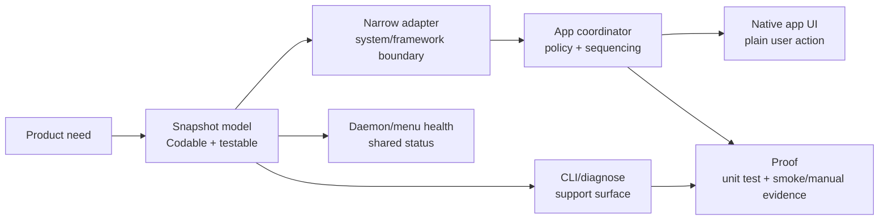

# Milestone: Professional macOS App

## Goal

1Context should behave like a first-class signed macOS app: users install the
DMG, run the app from `/Applications`, complete required setup in native UI,
open the wiki at a normal local HTTPS address, receive signed updates, and can
remove app-owned machinery cleanly.

The CLI remains a support and automation surface. It should diagnose, repair,
and report the same app-owned state, but it should not be the normal setup,
install, update, or permissions path.

## Capability Pattern

Every professional app capability should follow the same shape:

This gives each domain the same responsibilities:

- `Snapshot`: pure state and user-facing next action.
- `Adapter`: the framework or OS integration, hidden behind our target.
- `Coordinator`: app policy, ordering, retries, and repair.
- `UI`: the primary path for normal users.
- `CLI`: support path that never steals macOS permissions from the app identity.
- `Health`: menu, runtime, and diagnostics all report one truth.
- `Proof`: deterministic smoke when possible; clean-machine evidence when the OS
  requires real consent.

## Done When

- Notarized release packaging staples and validates both `1Context.app` and the
  downloadable DMG.
- Sparkle is embedded, signed, and hidden behind `OneContextUpdate`.
- Sparkle/appcast validation proves version, signature, release notes, and update
  artifact integrity before publish.
- Updating from an older app preserves or repairs Local Wiki Access.
- Required setup and future permissions use the same readiness pattern and block
  only the dependent feature.
- Uninstall removes app-owned LaunchAgents, agent hooks, local HTTPS trust, and
  ServiceManagement helper state without touching user wiki content unless the
  user asks.
- A clean-machine script/checklist covers DMG open, move to Applications, setup,
  wiki open, relaunch, update, and uninstall.

## Checklist

### 1. Baseline

- [x] DMG packaging exists.
  Evidence: `scripts/create-macos-dmg.sh`,
  `scripts/package-macos-release.sh`, `scripts/validate-macos-dmg.sh`.
- [x] App placement is app-owned.
  Evidence: `OneContextInstall` and `AppDelegate.handleAppInstallAtLaunch()`.
- [x] Required setup is app-owned and modeled as readiness.
  Evidence: `OneContextAppReadiness` feeds menu, CLI, and daemon health.
- [x] Product local web defaults to portless local HTTPS.
  Evidence: `LocalWebURLMode.localHTTPSPortless` default.
- [x] High-port HTTP remains test-only.
  Evidence: deterministic smoke harnesses explicitly set
  `ONECONTEXT_WIKI_URL_MODE=high-port-http`.

### 2. Notarization And DMG

- [x] Use one notarization entrypoint for `.app` and `.dmg` artifacts.
  Evidence: `scripts/notarize-macos-artifact.sh`.
- [x] Keep the old app notarization script as a compatibility wrapper.
  Evidence: `scripts/notarize-macos-app.sh`.
- [x] Package flow notarizes/staples the DMG when `NOTARIZE=1`.
  Evidence: `scripts/package-macos-release.sh`.
- [x] Add release validation that fails if a notarized build lacks a stapled DMG
  ticket.
  Proof: `ALLOW_UNNOTARIZED` absent and `validate-macos-dmg.sh` checks app and
  DMG stapler/spctl state.
- [ ] Run one Developer ID notarized package on a clean Mac account.
  Proof: screenshot/log bundle with Gatekeeper opening the DMG and app.

### 3. Sparkle Updates

- [x] Keep native updater state behind `OneContextUpdate`.
  Evidence: `NativeUpdater.swift`.
- [x] Add Sparkle dependency behind `OneContextUpdate`.
  Proof: menu and CLI do not import Sparkle directly; only
  `OneContextSparkleUpdate` imports Sparkle.
- [x] Embed Sparkle.framework in `Contents/Frameworks` and sign it in the app
  build.
  Proof: `codesign`, `otool -L`, rpath checks, and release validation pass.
- [x] Add a Sparkle appcast generation entrypoint.
  Proof: `scripts/generate-sparkle-appcast.sh` wraps Sparkle `generate_appcast`
  for the release DMG and release notes.
- [x] Generate and validate production appcast feed artifacts.
  Proof: `v0.1.51` generated a production Sparkle appcast with EdDSA signature,
  versioned DMG URL, and embedded release notes.
- [ ] Add local appcast update smoke from controlled fixture builds.
  Proof: harness installs one fixture app, serves a local appcast for the next
  fixture app, updates, then verifies version, wiki, setup readiness, helper
  repair, and rollback behavior.

### 4. Update-Safe Local HTTPS

- [x] Local HTTPS setup detects stale proxy binaries.
  Evidence: `LocalWebSetupState.proxyExecutableCurrent`.
- [x] App launch can prompt/repair required setup.
  Evidence: setup window and local web setup flow.
- [x] After app replacement, readiness detects stale helper state before opening
  the wiki.
  Proof: smoke copies a new app with changed helper SHA and sees Needs Setup or
  repair prompt.
- [x] CLI exposes update-safe Local Wiki Access repair.
  Evidence: `1context setup local-web repair` re-runs the app-owned setup
  installer and refreshes the helper/trust state.
- [x] Sparkle update completion triggers setup re-check before opening the wiki.
  Proof: the `0.1.50` to `0.1.51` GUI update relaunched into a healthy app;
  `1context status --debug` reported setup ready, helper diagnostics current,
  and the local wiki returned HTTP 200.

### 5. Permissions Suite

- [x] Sensitive permissions have an app-owned snapshot model.
  Evidence: `OneContextPermissions`.
- [x] CLI does not check sensitive permissions as itself.
  Evidence: `MacOSPermissionChecker(checkCurrentProcess: false)` behavior.
- [ ] Screen Recording becomes a required setup row when passive capture ships.
  Proof: feature gate fails closed and setup UI shows Grant/Granted.
- [ ] Accessibility becomes a required setup row only for features that need UI
  inspection/control.
  Proof: feature gate and setup UI tests.

### 6. Uninstall And Cleanup

- [x] LaunchAgent cleanup exists.
  Evidence: `1context uninstall` and `LaunchAgentManager`.
- [x] Local Wiki Access cleanup exists.
  Evidence: `1context setup local-web uninstall`.
- [x] Add app-owned uninstall command.
  Proof: `1context uninstall` removes app-owned agents/helpers/trust while
  preserving `~/1Context` by default.
- [x] Add delete-data mode.
  Proof: `1context uninstall --delete-data` removes approved user/app support
  paths and refuses unsafe paths.
- [x] Add non-destructive uninstall command smoke.
  Evidence: `scripts/test-macos-uninstall-command.sh` validates CLI shape,
  unknown-argument failure before cleanup, and uninstall script syntax.
- [ ] Add full uninstall cleanup smoke.
  Proof: no LaunchAgent, trusted local CA, ServiceManagement helper, or managed
  agent hook remains afterward.

### 7. Clean-Machine Acceptance

- [x] Add a clean-machine checklist script that collects evidence paths.
  Proof: one command prints each manual step and writes a timestamped evidence
  folder.
- [ ] Test DMG open and drag/self-move to Applications.
- [ ] Test first launch setup and local HTTPS wiki open.
- [ ] Test quit/relaunch.
- [ ] Test update.
  Note: GUI Sparkle update from `0.1.50` to `0.1.51` passed on this machine, but
  the clean-machine acceptance pass still needs its own captured evidence.
- [ ] Test uninstall cleanup.

## Notes

- Current baseline: `v0.1.51` has install placement, setup readiness, local
  HTTPS, signed/notarized DMG packaging, production Sparkle appcast, GUI update,
  menu uninstall, and support diagnostics in the app-owned shape.
- Remaining professional app work is summarized in
  [macos-professional-app-remaining-work.md](macos-professional-app-remaining-work.md).
- Immediate next step: run the full clean-machine checklist against the
  notarized DMG, then turn the manual update proof into a local appcast smoke
  with rollback coverage.
