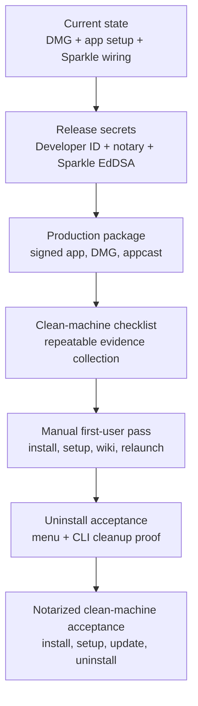

# Professional macOS App Remaining Work

## Goal

This document records the state of 1Context after the DMG install and Local Wiki
Access work, and defines the remaining path to a first-class macOS app release.
It is intentionally outcome-oriented: each remaining item should produce evidence
that future agents can re-run or inspect.

The guiding product shape is:

- users install a DMG and run `/Applications/1Context.app`;
- setup is app-owned, native, and required for dependent features;
- local wiki access works at `https://wiki.1context.localhost/your-context`;
- updates are app-owned through Sparkle behind `OneContextUpdate`;
- uninstall removes app-owned privileged/background state cleanly;
- clean-machine evidence proves the full flow before notarized release testing.

## Current State

- DMG packaging exists and validates.
  Evidence: `scripts/package-macos-release.sh`,
  `scripts/create-macos-dmg.sh`, `scripts/validate-macos-dmg.sh`.
- The app can be installed into `/Applications/1Context.app` from the DMG.
- The app owns first-launch setup. Local Wiki Access is surfaced in the setup
  window and reported through CLI/status diagnostics.
- Local Wiki Access is now working on this machine:
  - `1context setup local-web status` reports `Setup Ready: yes`.
  - `launchctl print system/com.haptica.1context.local-web-proxy` reports the
    helper running.
  - `curl https://wiki.1context.localhost/your-context` returns HTTP 200.
- The important ServiceManagement packaging bug is fixed:
  - Failing layout: `BundleProgram = Contents/MacOS/1context-local-web-proxy`
    produced launchd exit 78 and `The specified path is not a bundle`.
  - Working layout: `BundleProgram = Contents/Resources/1context-local-web-proxy`.
  - The generated app no longer leaves the privileged proxy in `Contents/MacOS`.
- The update boundary exists as `OneContextUpdate`, and Sparkle now lands behind
  the app-only `OneContextSparkleUpdate` adapter.
- The uninstall command shape exists, but the full cleanup proof is not complete.
  Dragging the app to Trash removes the app bundle only; it does not necessarily
  unregister ServiceManagement helpers, local certificate trust, logs, or user
  state.

## Sparkle Compared With Install And Uninstall

Sparkle is the right native updater layer, but it is not a substitute for install
or uninstall.

| Capability | Owner | What It Should Do | What It Should Not Do |
| --- | --- | --- | --- |
| Initial install | DMG plus `OneContextInstall` | Get the app into `/Applications`, replace or relaunch deliberately, and avoid running setup from transient copies. | It should not run Homebrew, terminal scripts, passive capture, or update checks before the app is installed. |
| Required setup | `OneContextSetup` plus `OneContextLocalWeb` | Ask for Local Wiki Access, install certificate trust, register the helper, verify the wiki. | It should not silently fall back to high-port HTTP in product mode. |
| Updates | Sparkle behind `OneContextUpdate` | Check appcast, verify signatures, replace the installed app, relaunch, and report update state to menu/CLI. | It should not own local wiki permissions directly or expose Sparkle details to menu/CLI callers. |
| Post-update repair | `OneContextUpdate` plus `OneContextSetup` | After app replacement, re-check helper SHA/setup readiness and prompt repair before opening the wiki. | It should not assume the old ServiceManagement helper is still correct. |
| Uninstall | CLI and menu-bar uninstall flow | Stop/remove helper registration, local certificate trust, LaunchAgents, managed agent hooks, logs/cache when requested, and optionally app/user data. | Sparkle does not provide a complete uninstall story for our app-owned privileged and local trust state. |
| Clean-machine harness | Release/test scripts | Reset to a known test state, launch the user flow, collect evidence, and fail on missing cleanup. | It should not be the normal user path. |

Sparkle documentation says Sparkle uses an appcast feed with `SUFeedURL`, requires
incrementing bundle versions, and can generate appcasts and delta updates with
`generate_appcast`. It also supports update archives such as DMG, ZIP, tar, Apple
Archives, and installer packages, so our release DMG can be part of the update
story if the signing/appcast flow is correct.

Apple's ServiceManagement documentation says LaunchDaemon helper executables can
live inside the app bundle and are referenced through `BundleProgram` relative to
the bundle, with examples like `Contents/Resources/mydaemon`. That is the shape
we should keep for the local HTTPS proxy.

## Target Sequence



The sequencing matters:

1. Configure the real release identities and Sparkle signing key before treating
   any artifact as production-shaped.
2. Build one signed/notarized DMG plus appcast from the same release command.
3. Use the clean-machine checklist to make every manual consent step explicit.
4. Verify install, setup, wiki, relaunch, update check, and uninstall cleanup from
   the same evidence bundle.
5. Use the harness to make notarized clean-machine testing routine instead of
   bespoke.

## Remaining Checklist

### 1. Clean Uninstall

- [x] Add or harden `1context uninstall` so it unregisters app-owned runtime
  services from the support CLI.
  Proof: `launchctl print system/com.haptica.1context.local-web-proxy` fails
  afterward.
- [x] Remove local certificate trust and setup marker during uninstall.
  Proof: `security find-certificate -a -c "1Context"` finds no managed cert.
- [x] Remove app-owned LaunchAgents and managed agent hooks.
  Proof: `launchctl print gui/$UID/com.haptica.1context*` fails and agent config
  no longer contains managed 1Context hooks.
- [x] Add `Uninstall 1Context...` in the menu bar.
  Proof: user can choose keep user content or delete app-owned data.
- [x] Decide whether the menu-bar uninstall removes the app bundle itself or
  opens Finder after cleanup for the final Trash step.
  Proof: documented UI copy and deterministic behavior.
- [ ] Add full uninstall smoke.
  Proof: no helper, no trusted cert, no LaunchAgents, no managed hooks remain.

### 2. Manual First-User Flow

- [ ] Run clean uninstall on this Mac.
- [ ] Open the DMG and install to `/Applications`.
- [ ] Launch app, grant Local Wiki Access, and open wiki.
- [ ] Quit and relaunch app.
- [ ] Verify menu status, CLI status, and runtime health all agree.
- [ ] Run uninstall and verify cleanup.

### 3. Clean-Machine Harness

- [x] Add a harness script that creates a timestamped evidence folder.
- [x] The harness should record app version, bundle ID, helper path, launchd
  state, setup status, wiki HTTP result, logs, and screenshots where possible.
- [x] The harness should support phases:
  - `preflight`
  - `install`
  - `setup`
  - `relaunch`
  - `update`
  - `uninstall`
- [ ] The harness should be able to start from a cleaned local machine and fail
  if old helper/cert state remains.
- [x] Manual consent steps should be explicit and resumable.

### 4. Sparkle Integration

- [x] Add Sparkle as a dependency behind `OneContextUpdate`.
  Proof: `OneContextMenuBar` and `OneContextCLI` do not import Sparkle directly.
- [x] Embed `Sparkle.framework` in `Contents/Frameworks` and sign it in both
  development and Developer ID release builds.
  Proof: `codesign`, `otool -L`, and release validation check framework state.
- [x] Add `SUFeedURL` and `SUPublicEDKey` release configuration.
  Proof: release validation fails when configured builds are missing keys.
- [x] Add appcast generation tooling.
  Proof: `scripts/generate-sparkle-appcast.sh` uses Sparkle `generate_appcast`
  against the signed release DMG.
- [x] Add production release secret bootstrap for Developer ID, notarytool, and
  Sparkle EdDSA keys.
  Proof: `scripts/configure-macos-release-secrets.sh` detects the Developer ID
  identity, App Store Connect key file, and Sparkle public key.
- [ ] Generate appcast artifacts with the production EdDSA key.
  Proof: Sparkle `generate_appcast` validates update archives, version, EdDSA
  signature, release notes, and downloadable artifact URL.
- [ ] Add local appcast update smoke.
  Proof: install older app, serve local appcast, update to newer app, relaunch.
- [ ] After Sparkle update, re-run required setup readiness before opening wiki.
  Proof: stale helper SHA triggers repair or setup window, then wiki returns 200.
- [ ] Verify failed update leaves old app usable.
  Proof: update-failure smoke preserves old app launch and status.

### 5. Notarized Release Acceptance

- [ ] Build with Developer ID signing.
- [ ] Notarize and staple the app and DMG.
- [ ] Validate with `spctl` and `stapler`.
- [ ] Run the clean-machine harness against the notarized DMG.
- [ ] Capture an evidence bundle for the release checklist.

### 6. Future Permissions

- [ ] Promote Screen Recording to a required setup row when passive capture
  ships.
- [ ] Promote Accessibility to a required setup row only for features that need
  UI inspection/control.
- [ ] Keep CLI/daemon from becoming accidental permission owners.
- [ ] Add visible menu states for missing permission, paused, active, and
  degraded future sensor modes.

## Evidence Commands

These commands are useful when checking the current professional-app state:

```bash
/Applications/1Context.app/Contents/MacOS/1context-cli setup local-web status
launchctl print system/com.haptica.1context.local-web-proxy
lsof -nP -iTCP:443 -sTCP:LISTEN
curl -k --resolve wiki.1context.localhost:443:127.0.0.1 \
  -o /tmp/1context-wiki.html \
  -w 'wiki_http=%{http_code}\n' \
  https://wiki.1context.localhost/your-context
```

Release artifact checks:

```bash
ALLOW_UNNOTARIZED=1 NOTARIZE=0 ./scripts/package-macos-release.sh
./scripts/validate-macos-dmg.sh dist/1Context-<version>-macos-arm64.dmg

ONECONTEXT_SPARKLE_FEED_URL="https://updates.1context.com/appcast.xml" \
  ./scripts/package-macos-production-release.sh

./scripts/harness-macos-clean-machine-checklist.sh \
  dist/1Context-<version>-macos-arm64.dmg
```

## References

- Sparkle documentation: https://sparkle-project.org/documentation/
- Sparkle sandboxing and signing notes:
  https://sparkle-project.org/documentation/sandboxing/
- Apple ServiceManagement overview:
  https://developer.apple.com/documentation/servicemanagement/
- Apple helper migration notes:
  https://developer.apple.com/documentation/servicemanagement/updating-helper-executables-from-earlier-versions-of-macos

## Immediate Next Step

Configure the notarytool issuer ID and production update feed URL, then run one
production package. After that, use the clean-machine checklist to collect the
manual install -> setup -> wiki -> relaunch -> update -> uninstall evidence pass.
