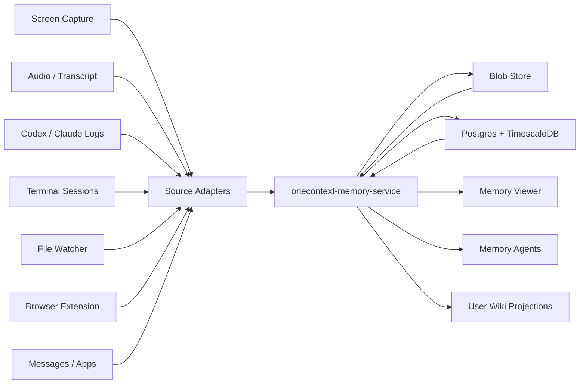

# 1Context Memory DB Infra And Viewer Spec

## 0. Purpose

The memory database is the evidence layer. The viewer is the trust layer.

The database records time-bounded objects from every source. The viewer makes
those objects visible, searchable, playable, inspectable, and traceable back to
their sources.

This spec sits on top of [Memory DB Design Spec](memory-db-design-spec.md). That
document defines the Postgres and TimescaleDB data model. This document defines
how the system should run, how sources should connect, and what the user should
see.

## 1. Product Posture

1Context memory should feel like a local evidence studio, not a black-box AI
recall feature.

The posture:

```text
evidence first
normalize lightly
preserve provenance
derive later
show the source
make the default path delightful
```

The system should be boring where correctness matters and expressive where the
user explores memory:

```text
boring infra: migrations, append, blobs, health, query APIs
expressive viewer: lanes, zoom, search, media, provenance, corrections
```

The viewer must never make a summary feel more authoritative than the evidence
behind it. Every derived memory, transcript, OCR span, or agent summary should
have an obvious "show sources" path.

## 2. System Shape

V0 has five long-lived parts:

```text
onecontext-memory-db          Rust crate with migrations and type contracts
onecontext-memory-service     local Rust service that owns DB access
source adapters               small source-specific producers
blob store                    local content-addressed large-object storage
memory viewer                 local UI over viewport/search/object APIs
```

The memory service is the only component that writes directly to Postgres in
normal operation. Source adapters submit Perception DB object inputs. The viewer
reads through service APIs.



## 3. Local Deployment

The local app owns lifecycle. The user should not have to learn Postgres to turn
remembering on.

V0 deployment targets:

```text
Developer mode:
  repo-managed DB container or local Postgres
  explicit migration command
  visible health page

Installed local mode:
  app-owned Postgres/Timescale service or packaged runtime
  app-owned memory service LaunchAgent
  local blob store under user-owned 1Context data
  viewer reachable from the menu bar

Future hosted mode:
  managed Postgres/Timescale
  object storage such as R2, S3, GCS, or MinIO
  same envelope and viewer API
```

V0 should optimize for local-first reliability before hosted scale. Hosted
deployment should be a transport/storage change, not a new memory model.

## 4. Runtime Paths

User-owned durable memory data belongs under `~/1Context/context-engine`.
Application Support remains machinery.

Suggested installed paths:

```text
~/1Context/context-engine/memory-db/
  config.toml
  migrations/
  exports/
  repair/

~/1Context/context-engine/blobs/
  sha256/
    ab/
      cd/
        <sha256>

~/Library/Application Support/1Context/memory-db/
  run/
  sockets/
  staging/
  postgres/
  service-state.json

~/Library/Logs/1Context/memory-db/
  service.log
  migrations.log
  adapters.log
```

Rules:

```text
context-engine stores durable user-owned memory records and manifests
blobs are content-addressed and exportable
Application Support stores process state and database machinery
Logs store diagnostics
Caches store disposable previews and thumbnails
```

The app may delete and rebuild Application Support machinery. It must not delete
user-owned memory records or blobs without explicit user intent.

## 5. Service Responsibilities

`onecontext-memory-service` owns:

```text
migration status
DB connection pooling
Perception DB object input validation
lane and source auto-registration
blob registration
perception object insertion
edge insertion
viewport query APIs
object detail APIs
search APIs
health and diagnostics
privacy/redaction commands
export/import commands
```

It does not own:

```text
screen recording permissions
browser extension UX
terminal shell integration UX
agent reasoning
wiki rendering
summary quality decisions
media transcoding beyond basic metadata extraction
```

The service is a narrow, auditable kernel. Smart memory behavior should be a
client of the service, not tangled into the storage core.

## 6. Source Adapter Contract

Adapters are source-specific and disposable. The service contract is stable.

Every adapter submits Perception DB object inputs:

```json
{
  "user_id": "user uuid",
  "source_id": "source uuid",
  "lane_id": "lane uuid",
  "kind": "agent_message",
  "event_start": "2026-05-24T10:03:25Z",
  "event_end": "2026-05-24T10:03:25.000001Z",
  "source_record_key": "codex/session/abc123/message/42",
  "payload": {
    "agent_source": "codex",
    "session_id": "abc123",
    "role": "assistant"
  },
  "display_title": "Agent message",
  "display_text": "Implemented the migration contract.",
  "privacy_class": "normal"
}
```

Adapter rules:

```text
1. Never write directly to Postgres.
2. Never invent source-specific durable tables.
3. Emit event time, not just ingest time.
4. Use a tiny nonzero duration for instant events.
5. Keep raw source ids in payload.
6. Put large bytes in blobs before object insertion.
7. Attach derived objects with edges.
8. Mark privacy class as early as possible.
```

The service may auto-create a source and lane from stable keys when the adapter
does not yet know UUIDs:

```json
{
  "source_key": "codex.local_sessions",
  "lane_key": "agents.messages",
  "kind": "agent_message"
}
```

The first developer-facing adapter API should be this simple:

```rust
client.write_object(PerceptionObjectInput { ... }).await?;
```

## 7. Default Lanes

The product should start with useful lanes even before every source is live.

Default lane groups:

```text
screen
audio
ui
browser
agents
terminal
files
messages
derived
memory
system
```

Default lanes:

```text
screen.main
audio.mic
ui.events
browser.tabs
browser.pages
agents.sessions
agents.messages
agents.tools
terminal.commands
terminal.output
files.versions
messages.imessage
ocr.spans
transcript.spans
agent.summaries
memory.summaries
memory.facts
system.health
```

The viewer should let users hide, reorder, group, and pin lanes without changing
the underlying Perception DB objects.

### 7.1 Lane Cardinality

Persisted lanes are product tracks, not every possible conversation or source
instance. A connector should not create a lane per Slack channel, Discord
channel, iMessage thread, browser tab, repo, terminal window, or agent session.

Use:

```text
lane     broad thing the user can scan
source   adapter/source instance that produced objects
payload  high-cardinality ids such as channel_id, chat_guid, repo path
edges    relationships between related objects
viewer   virtual lane/group/filter for focused exploration
```

Examples:

```text
Slack channel #launch        lane=slack.messages, payload.channel_id=C...
iMessage thread              lane=messages.imessage, payload.chat_guid=...
Browser tab                  lane=browser.pages, payload.tab_id=...
Repo file change             lane=files.versions, payload.path=...
Agent session in this repo   lane=agents.messages, payload.agent_source=codex, payload.session_id=...
```

The viewer can offer temporary virtual lanes such as "Slack #launch" or
"guardian-app file changes", but those should be saved filters or layouts, not
new persisted lane rows by default.

## 8. Blob Store

Large bytes live outside Postgres.

V0 local blob store:

```text
~/1Context/context-engine/blobs/sha256/<first2>/<next2>/<sha256>
```

Blob metadata lives in `perception.blobs`:

```text
uri
sha256
content_type
byte_count
codec
duration_ms
width
height
blob_state
metadata
```

Blob rules:

```text
small JSON: perception.objects.payload
large files: perception.blobs + blob_id
screen/video/audio: perception.blobs + lazy viewer load
deleted heavy bytes: keep object row, set blob_state
exports: include manifest plus selected blobs
```

The viewer should never need blob bytes for ordinary timeline layout. It should
load media only when thumbnails, preview, playback, or detail inspection
requires them.

## 9. Protocol And Public Service API

V0 service API should be local-only and boring. The canonical method contract is
defined in [Memory DB API And Protocol Spec](memory-db-api-protocol-spec.md).
This infra spec only names the deployment surfaces.

Transport options:

```text
Unix domain socket JSON-RPC for app/service IPC
localhost HTTP adapter for browser-based viewer
CLI wrapper for diagnostics and tests
```

Canonical memory methods:

```text
memory.status
memory.describe
memory.writeObjects
memory.ingestSources
memory.queryViewport
memory.queryDensity
memory.hydrateObjects
memory.queryEdges
memory.searchText
memory.searchSemantic
memory.explain
```

Browser adapter shape:

```text
GET /api/memory/status
GET /api/memory/viewport
future: GET /api/memory/density
future: GET /api/memory/object
future: GET /api/memory/search
```

The local browser viewer uses HTTP only as a browser-safe adapter. Swift,
agents, and tests should target the Rust-owned memory protocol directly when
they do not need browser redaction.

## 10. Viewer Thesis

The viewer is not an admin dashboard. It is the product's memory surface.

The user should be able to answer:

```text
What was happening at this time?
What did I see, say, type, run, edit, or ask?
Which agent did what?
What source objects produced this summary?
Which blobs still exist?
What changed later?
What can be trusted?
```

The viewer should show every lane, but it should not overwhelm by default.
Start calm. Let depth unfold.

## 11. Viewer Layout

Primary surfaces:

```text
Timeline
Lane rail
Viewport controls
Object inspector
Provenance panel
Search panel
Media preview
Density overview
Privacy/redaction panel
```

Suggested desktop layout:

```text
┌──────────────────────────────────────────────────────────────┐
│ Top bar: time range, zoom, search, filters, health            │
├───────────────┬───────────────────────────────┬──────────────┤
│ Lane rail     │ Timeline canvas/list           │ Inspector    │
│               │                               │              │
│ screen.main   │ 10:03:20 screen chunk          │ selected obj │
│ codex.msgs    │ 10:03:21 Codex assistant       │ payload      │
│ terminal.out  │ 10:03:22 cargo test            │ blob preview │
│ files.vers    │ 10:03:24 envelope.rs changed   │ edges        │
│ memory.sum    │ 10:03:28 derived summary       │ sources      │
└───────────────┴───────────────────────────────┴──────────────┘
```

The timeline should support two visual modes:

```text
NLE mode: horizontal time axis with lane tracks
Log mode: dense chronological rows grouped by lane and time
```

NLE mode is for understanding overlap. Log mode is for reading text-heavy work.
The same data powers both.

## 12. Viewer Interactions

Required interactions:

```text
pan time
zoom time
jump to now
jump to object
select object
multi-select objects
filter lanes
filter kinds
search visible range
expand bundle
show source edges
show derived edges
open blob preview
copy citation URI
open raw JSON payload
mark sensitive
request redaction
export selected range
```

High-value keyboard shortcuts:

```text
space      play/pause time cursor for media ranges
f          focus selected object
e          show edges
j/k        next/previous object
[/]        previous/next bundle
cmd+f      search
1          NLE mode
2          log mode
3          density mode
```

Keyboard shortcuts should be discoverable through the app menu or a help panel,
not explained inline on the main canvas.

## 13. Object Inspector

Selecting any object opens a stable inspector:

```text
title
kind
role
lane
source
event_start / event_end
ingest_time
privacy_class
display_text
payload
blob metadata
source clock metadata
current/superseded state
incoming edges
outgoing edges
```

For derived objects, the inspector must make sources obvious:

```text
OCR span
  derived_from screen_chunk
  blob preview: screenshot frame
  payload: OCR engine, confidence, bounding box

Agent summary
  derived_from agent_session
  references terminal_output, file_version
  supersedes older summary
```

This is the trust loop.

## 14. Provenance View

The viewer needs a graph view, but it should start as an inspector panel rather
than a decorative full-screen graph.

Required edge groups:

```text
sources       objects this object derived from or references
outputs       objects derived from this object
corrections   supersedes / superseded_by chain
same time      objects in same bundle or overlapping event range
```

The user should be able to click from:

```text
summary -> source messages -> terminal output -> file version -> screenshot
```

without losing the original time context.

## 15. Search And Retrieval

Search modes:

```text
visible range search
global text search
kind/lane filters
payload filters
semantic search
provenance search
```

Example user-facing searches:

```text
show coding-agent tool summaries from this afternoon
find terminal commands that failed
show screenshots where Chrome was active
find memories derived from this session
show objects referencing guardian-app
show summaries superseded this week
```

The viewer should show search results on the timeline, not just as a detached
list. Search should answer both "what matched?" and "when did it happen?"

## 16. Privacy And Redaction UX

Privacy must be visible as a first-class object state.

Viewer privacy states:

```text
normal
sensitive
secret
redacted
blob missing
blob deleted
```

Required actions:

```text
mark selected object sensitive
mark selected object secret
redact selected object
delete selected blob only
export selected range with privacy filter
show redaction history
```

Deletion model:

```text
redaction creates a visible state transition
blob deletion can remove bytes while keeping timeline metadata
privacy export filters can omit payload text and blobs
source provenance should remain auditable unless explicit deletion requires removal
```

The viewer should make clear when the map remains but the media is gone.

## 17. Zoom Levels

The viewer chooses query strategy by zoom:

```text
sub-minute: raw perception.objects
minutes: raw perception.objects with lane virtualization
hours: perception.object_density_1m plus selected raw expansion
days: summaries, memories, and density aggregates
weeks: summaries, memories, and density aggregates
```

The viewer should render density first, then hydrate raw objects as the user
zooms or selects a time range.

## 18. Performance Budget

Initial target:

```text
open viewer: under 1 second after service is warm
load 1-hour viewport: under 500 ms for metadata
select object inspector: under 150 ms for metadata
blob preview: lazy, progressive, cancellable
search current viewport: under 500 ms
timeline rows visible at once: virtualized
```

The viewer should treat 5,000 raw objects as a normal viewport, not an extreme
case.

## 19. Implementation Path

The current macOS app already has the right supervision shape:

```text
LaunchAgent
  -> Swift 1contextd
       owns app identity, TCC/FDA surface, runtime paths, diagnostics, socket RPC
       supervises child binaries
       -> onecontext-wiki
       -> onecontext-memoryd
```

`onecontext-memoryd` should be a packaged Rust binary, not a second
LaunchAgent. Swift starts it, reports `memory.status`, runs local benchmarks,
and terminates it on runtime shutdown. Rust owns source connector cursors,
bounded ingest ticks, status JSON, and eventually Timescale writes.

V0 slices:

```text
1. Keep onecontext-memory-db crate as migration/type contract.
2. Add migration runner against a local TimescaleDB instance.
3. Add onecontext-memory-service with health, lanes, writeObjects, viewport, object show.
4. Add local blob store.
5. Add cursorized seed adapter for Codex logs through the shared agent IR.
6. Add cursorized seed adapter for Claude logs through the shared agent IR.
7. Add SQLite-cursor seed adapter for iMessage.
8. Add seed adapter for terminal command/output.
9. Add seed adapter for file versions.
10. Build viewer in log mode first.
11. Add object inspector and provenance panel.
12. Add NLE mode and density overview.
```

First proof should be:

```text
Codex/Claude reduced agent sessions + iMessage row + terminal output + file version
-> perception.objects
-> viewport query
-> derived summary
-> edges back to source objects
-> viewer shows all of it
```

Do not wait for screen/audio/browser capture to prove the database and viewer.
The first work-source slice is enough.

## 20. Viewer Acceptance Tests

### 20.1 Bundle View

Insert:

```text
1 screen chunk
1 terminal command
1 terminal output
1 Codex message
1 file version
```

Expected:

```text
all objects appear in the same time range
bundle expansion shows all five
lane filters isolate each lane
```

### 20.2 Inspector Trust Loop

Insert:

```text
screen_chunk
ocr_span derived_from screen_chunk
summary derived_from ocr_span
```

Expected:

```text
summary inspector shows source chain
clicking source opens OCR object
clicking OCR source opens screen chunk
screen chunk preview lazy-loads blob
```

### 20.3 Correction Chain

Insert:

```text
old summary
new summary supersedes old summary
```

Expected:

```text
normal viewport shows new summary only
history mode shows both
provenance panel shows supersedes edge
```

### 20.4 Missing Blob

Insert a perception object whose blob state is `deleted`.

Expected:

```text
timeline still renders object metadata
inspector shows blob deleted state
viewer does not crash or block
```

### 20.5 Dense Timeline

Insert 10,000 UI events across one hour plus summaries.

Expected:

```text
density mode opens quickly
raw expansion virtualizes rows
filtering to one lane stays responsive
```

## 21. Developer Experience

Developers should get a one-command local loop:

```bash
./scripts/memory-db-dev up
./scripts/memory-db-dev migrate
./scripts/memory-db-dev seed
./scripts/memory-db-dev viewer
./scripts/memory-db-dev test
```

The dev harness should create:

```text
local TimescaleDB
local blob directory
sample user
default lanes
sample sources
fixture perception objects
fixture edges
fixture blobs
```

Every serious viewer change should have:

```text
seed data
API snapshot test
browser-visible screenshot
pixel/DOM check for key lanes
```

## 22. Open Questions

These should stay explicit:

```text
Should installed local mode package Postgres/Timescale or require a managed service?
Should the first viewer be a web UI served by the local service or a native Swift surface?
What is the default blob retention policy for screen/audio?
How should iMessage import handle consent and redaction?
How much source text should terminal/Codex adapters inline versus blob?
When do we introduce semantic search in the UI?
What is the privacy model for multi-user hosted mode?
```

Default decisions for now:

```text
viewer API first
web viewer first
local blob store first
Codex/terminal/file-version slice first
screen/audio/browser later
semantic search after text and timeline retrieval feel excellent
```

## 23. Done When

The infra and viewer are real when:

```text
the app can start/stop the memory service
migrations run deterministically
source adapters can append without knowing SQL
the viewer can show a mixed time range across all seeded lanes
the inspector can trace a derived memory back to source objects
missing/deleted blobs are visible but nonfatal
search results appear in time context
exports can include a selected range with metadata, edges, and blobs
```

The human test:

```text
Can I open 10:00 to 11:00 and understand what happened across my tools?
Can I trust a memory because I can see what produced it?
Can I correct or redact without losing the history of what changed?
```

If yes, the viewer is doing its job.
