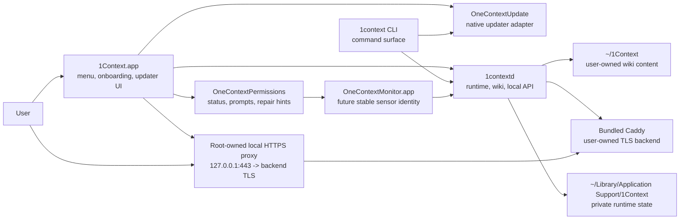
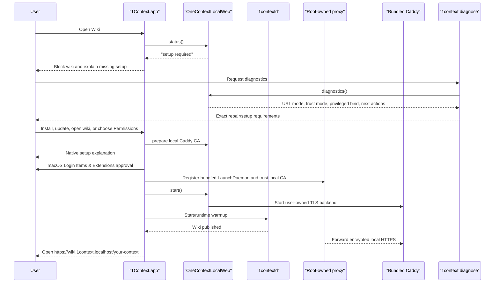
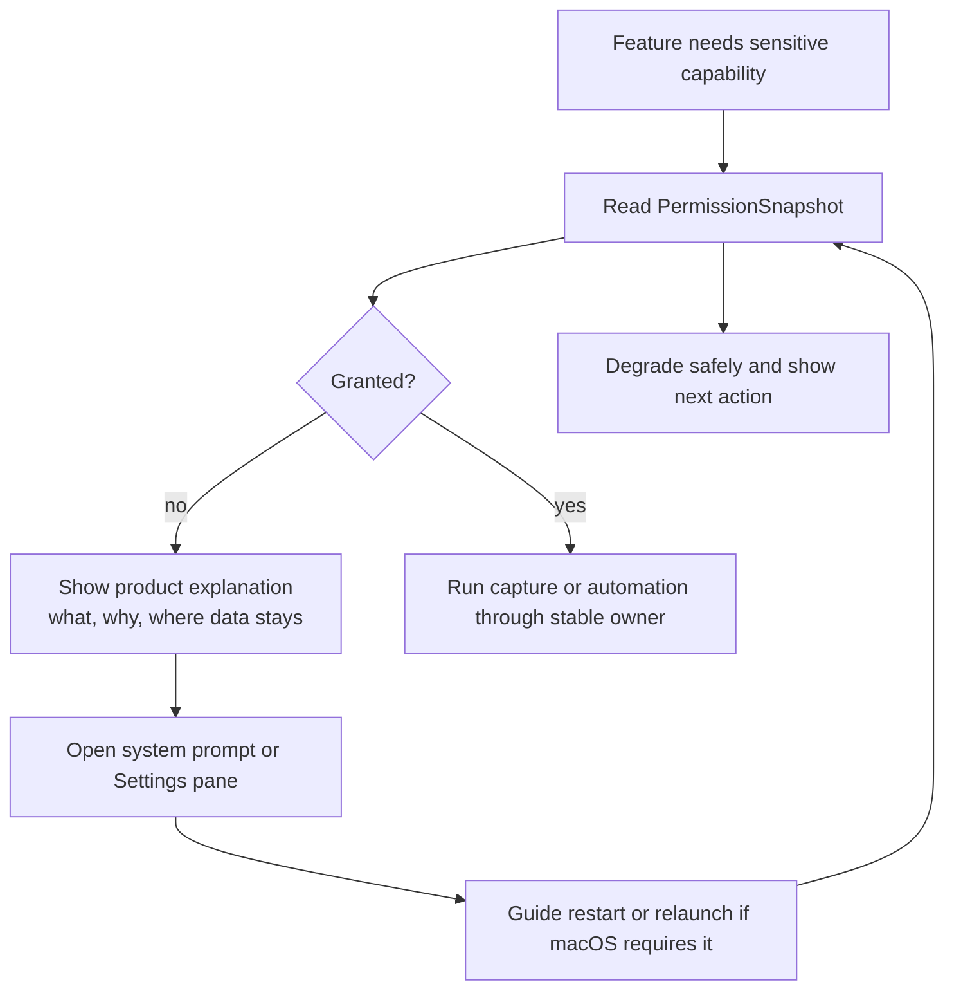
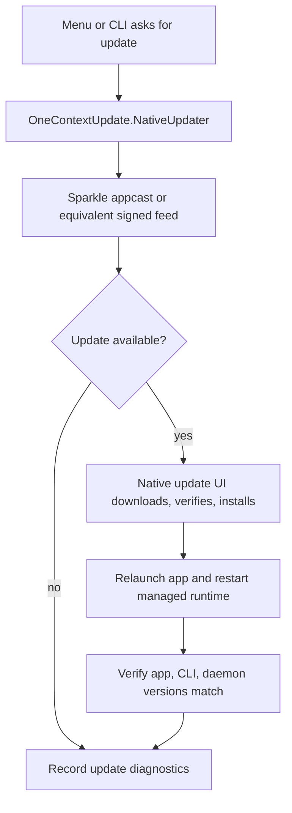
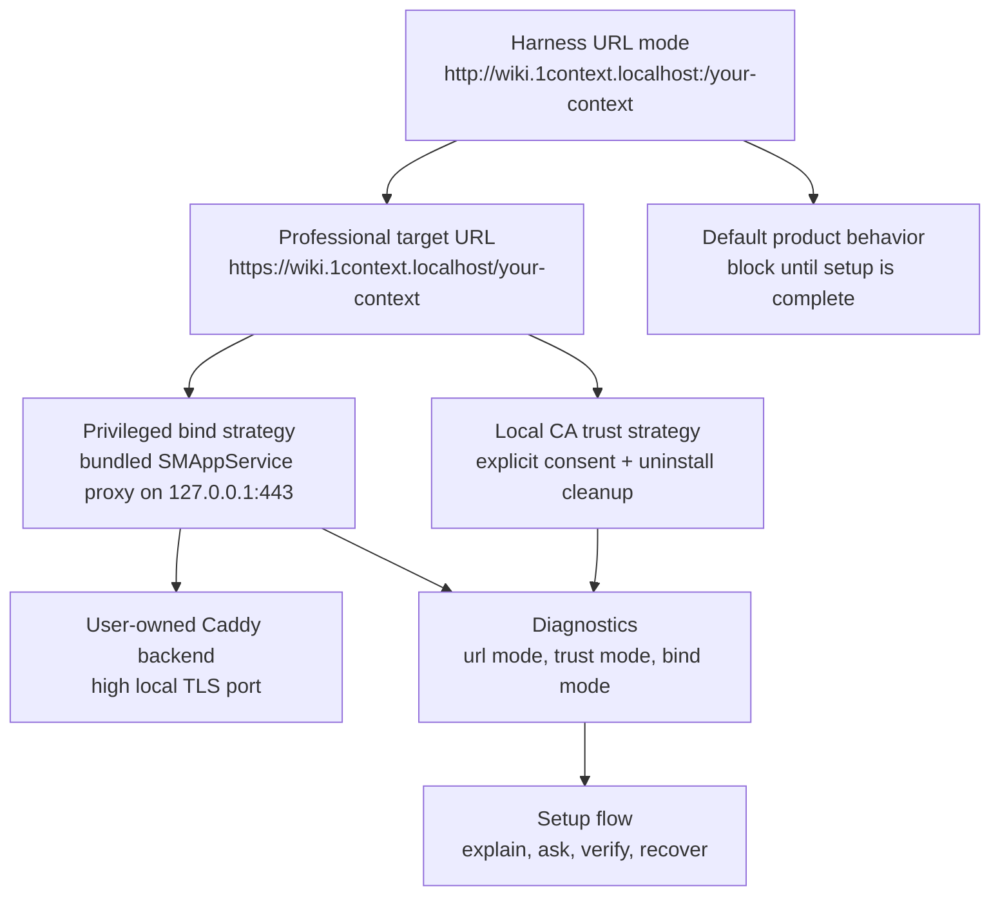

# Milestone: Native Permissions And App-Owned Updates

## Goal

Make 1Context feel like a real macOS app before public launch: the signed app owns update UX, permission onboarding, and sensitive capability consent; the daemon owns runtime/wiki work; the CLI remains a convenient command surface instead of the product's update or permission identity.

This milestone is intentionally evolutionary. Keep the current module spine, add the missing first-class domains, and avoid a sweeping folder rename until real code pressure justifies it.

Professional setup is required, not optional. If a required grant or local-web setup step is missing, the app should block the affected feature, explain the missing requirement, and guide the user to fix it. It should not silently fall back to a less secure or less professional mode once the launch contract requires local HTTPS and passive capture permissions.

## Done When

- The app has one canonical update owner: `1Context.app` through a native updater adapter.
- `1context update`, menu update, and diagnostics all report or trigger the same native update path.
- Permission status for Screen Recording, Accessibility, and future capture capabilities is represented by one shared model.
- Passive monitoring work is blocked behind explicit permission snapshots and stable signed bundle identities.
- The local wiki URL strategy has a required setup gate for local HTTPS, local-trust, and privileged-port behavior.
- `1context diagnose` reports update state, permission state, local web URL mode, and exact next actions without requiring guesswork.
- The plan has harness evidence for each major decision before we commit to user-facing launch behavior.

## Current Baseline

- The release app already bundles `1Context`, `1context-cli`, `1contextd`, Caddy, and memory-core resources in one signed app artifact.
- `OneContextUpdate` owns native updater state and diagnostics.
- `OneContextLocalWeb` owns Caddy config, diagnostics, and the canonical `https://wiki.1context.localhost/your-context` target, with high-port HTTP retained only for tests and local harnesses.
- Local HTTPS is implemented as a user-owned Caddy backend plus a bundled ServiceManagement LaunchDaemon for 127.0.0.1:443. The helper is approved through macOS Login Items & Extensions and does not read wiki content.
- `PERMISSIONS.md` already states that future Screen Recording and Accessibility features require product-approved prompts.
- The daemon exposes a narrow Unix socket and should remain the runtime/wiki coordinator, not the TCC permission surface.

## Architecture

## Current Required Setup Flow

In product mode, missing setup is a blocking state. The daemon may still publish
static wiki artifacts and run the local API, but the browser-facing wiki edge
does not start until local HTTPS setup is satisfied. `ONECONTEXT_WIKI_URL_MODE=high-port-http`
is reserved for deterministic tests, release smoke checks, and local harnesses.

## Proposed Module Shape

Keep existing modules:

- `OneContextMenuBar`: user-facing controls, onboarding entry points, update/permission menu state.
- `OneContextDaemon`: runtime, wiki publishing, local API, memory orchestration.
- `OneContextSupervisor`: LaunchAgent/login item lifecycle.
- `OneContextLocalWeb`: Caddy local web edge and URL diagnostics.
- `OneContextLocalWebProxy`: tiny bundled TCP proxy executable for `127.0.0.1:443`, registered through `SMAppService`.
- `OneContextUpdate`: native app-owned update domain.
- `OneContextPlatform`: filesystem paths, file modes, platform helpers.

Add only the load-bearing missing pieces:

- `OneContextPermissions`
  - `PermissionKind`
  - `PermissionStatus`
  - `PermissionSnapshot`
  - `PermissionChecker`
  - `AccessibilityPermission`
  - `ScreenRecordingPermission`
  - `PermissionDiagnostics`
- `OneContextMonitor` later, only if passive capture needs a separate stable `.app` identity.

## Checklist

### 1. Baseline And Decisions

- [x] Current app artifact already contains app, CLI, daemon, Caddy, and bundled resources.
- [x] Current docs already separate user content from app/runtime state.
- [x] Current local web contract already makes Caddy an implementation detail behind a stable wiki URL.
- [ ] Decide whether Sparkle is the native updater implementation or whether we need a thinner custom signed-feed adapter.
- [ ] Decide whether passive monitoring runs inside `1Context.app` at first or requires a separate `OneContextMonitor.app`.
- [ ] Locate or import the Littlebird reversed permission/setup Storybook reference, then name the reusable onboarding patterns we want to borrow.

### 2. Native Update Track

- [x] Add an `OneContextUpdate` native updater protocol with status, check, install, and diagnostics methods.
- [ ] Add a Sparkle spike behind that protocol in a small branch or throwaway target.
- [ ] Replace menu update UI calls with the native updater protocol.
- [x] Convert `1context update` from package-manager execution to native updater trigger/status output.
- [ ] Add release validation for appcast/feed version, app version, CLI version, daemon version, signature, notarization, and rollback diagnostics.

Evidence:

- `swift test --package-path macos`
- native updater diagnostics tests until Sparkle feed validation exists
- release artifact validation proves the signed app and update feed agree on version

### 3. Permission Domain Track

- [x] Add `OneContextPermissions` data types with no OS prompts yet.
- [x] Add pure tests for permission snapshots and diagnostics text.
- [x] Implement Accessibility status using `AXIsProcessTrustedWithOptions`.
- [x] Implement Screen Recording status using Core Graphics preflight/request APIs where supported.
- [x] Expose permission snapshots in `1context diagnose`.
- [ ] Add menu/onboarding surfaces that explain required permissions before invoking a system prompt.
- [ ] Ensure the daemon and CLI never become accidental permission owners for passive capture.
- [x] Add `OneContextSetup` as the app-level setup boundary that combines required local wiki setup with current/future macOS permissions.

Evidence:

- Swift unit tests cover snapshot serialization and user-facing repair hints.
- `1context diagnose` has stable permission output with redacted paths by default.
- Manual dev-machine capture: before grant, after grant, after app update, after app relaunch.

### 4. Passive Monitoring Track

- [ ] Define which process owns each future sensor capability.
- [ ] Keep first passive monitoring prototype behind explicit local feature flags.
- [ ] Route capture output to daemon/runtime state through a narrow RPC or file contract.
- [ ] Do not start passive capture from install, update, or diagnose.
- [ ] Add a visible menu state for paused, missing permission, active, and degraded sensor modes.

Evidence:

- Harness proves no sensor starts without explicit user consent state.
- Logs show sensor start/stop events without recording private content in logs.
- Diagnostics can explain why capture is disabled without attempting to enable it.

### 5. Caddy URL Experiment

Hypothesis: Caddy may be able to give us a cleaner local URL, but every nicer URL has a permission/trust tradeoff.

- [x] Baseline high-port harness mode: `http://wiki.1context.localhost:<test-port>/your-context`, no extra system permission.
- [x] Add a non-destructive Caddy config harness for current, portless HTTP, and local HTTPS modes.
- [x] Test portless HTTP: `http://wiki.1context.localhost/your-context`; document whether privileged bind or helper is required.
- [x] Test local HTTPS architecture: user-owned high-port TLS backend plus bundled ServiceManagement `127.0.0.1:443` proxy, with explicit certificate trust and uninstall cleanup.
- [x] Decide launch URL tier: target professional local HTTPS/portless, keep high-port HTTP only as an explicit test/development harness mode.
- [x] Add diagnostics fields for URL mode, trust mode, bind mode, and Caddy health.

Evidence:

- `scripts/experiment-caddy-url-modes.sh` captures Caddy config variants and expected failure modes.
- `scripts/experiment-caddy-url-modes.sh --live` proves high-port HTTP and high-port HTTPS can run without extra permission or local trust.
- `scripts/experiment-caddy-url-modes.sh --privileged` currently proves portless HTTP and portless HTTPS fail as a normal user with `bind: permission denied` on ports 80 and 443.
- `1context setup local-web status` reports exact trust/proxy readiness.
- Manual browser evidence for Safari/Chrome: launch the app, approve the native local HTTPS setup prompt, open `https://wiki.1context.localhost/your-context`, then run `1context setup local-web uninstall` for cleanup.
- Uninstall test should prove local trust and ServiceManagement registration are removed.

Current finding:

- Product direction: professional local HTTPS at `https://wiki.1context.localhost/your-context`.
- The product default is local HTTPS and blocks until trust and privileged bind are explicitly installed and reversible.
- The privileged component is a narrow bundled TCP proxy. It owns port 443 only and forwards encrypted traffic to user-owned Caddy.
- Portless HTTP is not a product path.
- Caddy's `tls internal` can try to install a local root certificate unless `skip_install_trust` is set; 1Context explicitly installs trust during setup instead of letting Caddy silently mutate trust settings.

### 6. Onboarding And Setup Flow

- [ ] Inventory Littlebird reversed Storybook setup screens and interaction patterns.
- [ ] Map borrowed patterns into 1Context-specific screens:
  - welcome,
  - local wiki ready,
  - optional agent integrations,
  - optional permissions,
  - update readiness,
  - diagnostics/support.
- [ ] Keep required sensitive permissions in setup and block dependent features until they are granted.
- [ ] Add a visible repair path for each missing required permission.
- [x] Add `1context setup local-web <status|install|uninstall>`.
- [x] Add menu repair entry for local HTTPS setup.
- [x] Run local HTTPS setup from the app with native alerts, ServiceManagement approval, and user keychain trust, without launching Terminal.
- [x] Prompt/repair on app launch when setup is missing or the installed proxy is stale after an app update.
- [x] Package install no longer runs local HTTPS setup; the app owns first-launch and post-update setup/repair.
- [x] Split local HTTPS recovery states so certificate trust/password failures and background-item approval show different repair prompts.

Evidence:

- Storyboard or SwiftUI preview screenshots for each state.
- UI copy reviewed against `PERMISSIONS.md`.
- Harness or snapshot tests cover state transitions if the UI layer supports it.

### 7. Diagnostics And Recovery

- [x] Extend `1context diagnose` with native updater state.
- [x] Extend `1context diagnose` with permission snapshots.
- [x] Extend `1context diagnose` with Caddy URL mode and local trust status.
- [ ] Add a single "support bundle" command later if logs become too spread out.
- [ ] Keep default diagnostics redacted and local-only.
- [x] Add an opt-in product HTTPS smoke test for the real portless URL and IPv4/IPv6 localhost path.

Evidence:

- Deterministic diagnose fixture output.
- Redaction test for home paths and private file contents.
- Deterministic release smoke test covers packaged high-port HTTP without touching machine trust.
- Product HTTPS smoke test covers `https://wiki.1context.localhost/your-context` behind explicit interactive consent.

## Open Questions

- Does Sparkle fully fit our menu-bar, bundled-CLI, bundled-daemon shape, or do we need a thin adapter around Sparkle plus custom daemon restart handling?
- Should `1contextd` remain a bare executable LaunchAgent, or should a future runtime helper be embedded as a login item `.app` for cleaner identity?
- Which process should own Screen Recording once passive monitoring is real: main app, monitor helper app, or a sensor-specific helper?
- How should we harden ServiceManagement helper upgrades across app updates and Sparkle restarts?
- How much of the Littlebird setup flow is generic onboarding craft versus specific implementation we should avoid copying too literally?

## Immediate Next Step

Build the smallest proof-carrying spike:

1. Manually exercise first launch, native local HTTPS setup prompt, browser open, app relaunch, stale-proxy repair after replacing the app bundle, and `1context setup local-web uninstall` on a clean Mac account.
2. Spike Sparkle behind the new `OneContextUpdate` protocol.
3. Inventory the Littlebird reversed setup flow and decide which onboarding states to reuse.
