# Fast Memory Pipeline

The experiment prompts are good. The experiment execution shape was too slow.
The product path keeps the prompt work and replaces rediscovery loops with
pre-rendered context, first-class birth loading, concurrency caps, and
deterministic generators where an agent is unnecessary.

```mermaid
flowchart TD
  A["Raw local activity already captured\nCodex sessions, Claude Code sessions, screen/capture summaries,\nmanual events, artifacts, cwd, session ids, timestamps"] --> B["Lakestore query helper\nOne ordered read per time window\nFilter by harness/session/source\nNo hired agent does default SQL/Bash exploration"]

  B --> C["Experience packet renderer\nDeterministic and hashable\nGroups concurrent streams into a braid:\nmanifest, global weave, per-stream transcript files,\nshared files/conflicts, unresolved issues"]

  C --> D["Birth-loaded hired agent context\nScribe default: braided_lived_messages\nAll user + assistant messages, no tool chatter\nRaw tool traces remain in lakestore for retries\nThe agent starts with the past life already present\nnot as a path it has to remember to read"]

  D --> E["Hourly scribe jobs\nmemory.hourly.scribe for strict one-hour witnesses\nmemory.hourly.block_scribe for fixed 4-hour Opus blocks\nBoth keep hourly output files and explicit skip/retry statuses"]

  E --> F["Prompt-size decision surface\nRunner records estimated_tokens, prompt_footprints, and large_prompt_count\nDefault route budget is 128k estimated tokens\nOversized 4-hour blocks split into hourly witnesses\nOversized single hours split into shard witnesses plus one aggregate scribe\nNo hidden truncation of personal context"]

  F --> G["Talk folder as shared wiki input\n_meta.yaml plus timestamped md entries\nconversation, reply, proposal, concern, question,\nsynthesis, decided, deferred, contradiction, redacted"]

  G --> H["Parallel day-layer jobs when dependency allows\nDaily editor posts proposal.editor-day-* from the same loaded folder\nConcept scout posts one high-signal proposal/question/concern\nNo raw event rediscovery"]

  H --> I["Deterministic generators\nRender talk folder\nResolve brackets\nBuild topics/projects indexes from concept-page frontmatter\nArchive old closed talk entries\nThese should not be agent jobs"]

  I --> J["Curator and librarian layer\nCurator decides proposal -> article edit when available\nLibrarian creates/expands/demotes concept pages\nThese are slower because judgment is the point"]

  J --> N["State-machine evidence\nArtifacts validated, ledger events written,\nstate machine advances from evidence rows,\nnot hidden chat state"]

  B -. speed rule .-> K["Cache and reuse boundaries\nRaw Lance events are source of truth\nRendered experience packets are materialized artifact rows\nHash rendered context and prompt stacks for provenance/replay\nReuse packet per hour/day across multiple hires"]
  I -. speed rule .-> L["Replace agents with code when the output is mechanical\nSorting, rendering, bracket resolution, topic indexes,\narchive moves, basic validation"]
  H -. speed rule .-> M["Only serialize true dependencies\nHourly fanout is parallel\nEditor and concept scout can often run together\nCurator waits for proposals\nBiographer waits for filled article sections"]
```



## Speed Rules

1. Render bounded context outside the agent.
2. Load the rendered packet as lived experience at birth.
3. Keep task prompts separate from experience packets for reuse.
4. Fan out independent hires under `runtime_policy.max_concurrent_agents`; this repo defaults to 8.
5. Use deterministic scripts for rendering, indexing, archiving, and bracket resolution.
6. Let slow agents exist only where judgment is the job.
7. Validate artifacts directly and advance state machines from evidence.
8. Hash packets and prompt stacks for provenance, not as repeated hot-path work over the whole store.
9. Target throughput is a whole active month in about one hour; every runner should report wall time and validation failures.

## Current April 2026 Sizing

`1context job run-month-hourlies --month 2026-04 --plan-only` discovers:

- 25 active days
- 208 active hours
- 498,826 raw events
- default max concurrency: 8

That means the target budget is roughly 17 seconds per hourly scribe on average
at concurrency 8 if the whole month is to finish in about one hour. Any hour
packet that takes minutes to prepare or launches with hundreds of thousands of
raw events is disqualified by design. Scribe jobs therefore default to
`braided_lived_messages`: all user and assistant messages are loaded as lived
context, while tool calls/results stay in lakestore for retry, forensic, and
exact-log jobs.

`1context job run-month-hourly-blocks --month 2026-04 --plan-only` discovers:

- 72 fixed 4-hour block hires
- 208 active hours covered by those blocks
- 9 waves at default concurrency 8

That changes the target budget to roughly 6-7 minutes per block hire. A live
first-block Opus run on `2026-04-01T00-03Z` used a 758 KB tool-loaded birth
prompt and took about 301 seconds. The messages-only projection for the same
block used about 269 KB and took about 251 seconds while writing four valid
hourly entries. This fits the rough month-in-an-hour envelope only if later
blocks are not much slower, so prompt-size monitoring is part of the runner
payload. The default routing threshold is 128,000 estimated tokens for the
assembled prompt. A warning is not a failure because dense human/assistant
conversation may be the point of the memory. It is a decision surface.

Dense blocks are handled without lossy trimming. If a 4-hour block is too large
for the desired speed envelope, run with `--split-large-blocks
--max-prompt-tokens 128000`. That fallback keeps the same messages-only lived
experience projection, but launches separate one-hour witnesses for the
oversized block instead of summarizing away non-obvious context.

If a single hour remains over 128k estimated tokens after splitting, the runner
now routes it through `memory.hourly.shard_scribe` jobs followed by one
`memory.hourly.aggregate_scribe`. Shards are stream-first, then recursively split
by contiguous event slices until each shard birth is under the route budget when
possible. The aggregator is prepared after shard witnesses run so its prompt is
born with the shard notes already loaded.

## Benchmark Loop

Use capped live batches before scaling:

```bash
uv run 1context job run-month-hourlies \
  --month 2026-04 \
  --workspace /tmp/onecontext-month-live-bench-8 \
  --limit-hours 8 \
  --run-harness \
  --json
```

For the fixed 4-hour mode:

```bash
uv run 1context job run-month-hourly-blocks \
  --month 2026-04 \
  --workspace /tmp/onecontext-month-block-bench-8 \
  --limit-blocks 8 \
  --run-harness \
  --json
```

To keep all context but avoid giant 4-hour births:

```bash
uv run 1context job run-month-hourly-blocks \
  --month 2026-04 \
  --workspace /tmp/onecontext-month-block-bench-8 \
  --limit-blocks 8 \
  --split-large-blocks \
  --max-prompt-tokens 128000 \
  --run-harness \
  --json
```

Read:

- `batch.duration_ms` for wall time
- `batch.result_count` for completed hires
- `batch.validation_failure_count` for quality gate failures
- `batch.errors` for harness/runtime failures
- `large_prompt_count`, `oversized_single_hour_count`, `prompt_footprints`,
  `estimated_tokens`, and `split_large_blocks` for dense blocks that would
  otherwise threaten throughput

Retry flow is explicit. A block scribe may mark an hour `needs-retry`; then run:

```bash
uv run 1context job run-month-hourly-retries \
  --month 2026-04 \
  --workspace /tmp/onecontext-month-block-bench-8 \
  --run-harness \
  --json
```

Retry jobs use `memory.hourly.scribe` with `braided_lived_transcript` so the
single-hour fallback can see tool detail when the block-level messages-only
view was not enough.

Then estimate:

```text
estimated_month_minutes =
  (active_hour_count / result_count) * batch.duration_ms / 60000
```

If the estimate is over 60 minutes, reduce agent work before raising
concurrency: smaller agent-facing packets, stricter output contracts,
deterministic pre-summaries, or cheaper/smaller model tiers for low-signal
hours.

Resumability is mandatory. Month/day runs skip already-valid hourly files by
default, so interrupted catchup does not redo work. Use `--no-skip-existing`
only for deliberate regeneration.

## 128k Token Routing Policy

The scheduler treats 128k estimated tokens as the default agent birth budget.
This is a routing policy, not a forgetting policy:

1. Try the planned fixed 4-hour block.
2. If the assembled prompt is over 128k estimated tokens and
   `--split-large-blocks` is enabled, split that block into one hired agent per
   active hour.
3. If an individual hour is still over 128k, split it into stream-first shard
   witnesses. If a stream shard is still too large, recursively split it by
   contiguous event slices.
4. Run one aggregate scribe for that hour after shard notes exist. The
   aggregate scribe writes the canonical hourly conversation entry.
5. Never silently truncate user/assistant messages to fit the budget.

The planner is intentionally cheap. It does not render full prompts to discover
that they are too large. It estimates route size from agent-facing event text,
event counts, stream counts, and coarse prompt overhead, then writes a
`memory_route_plan` artifact for inspection and replay:

```bash
uv run 1context job plan-month-routes \
  --month 2026-04 \
  --limit-blocks 8 \
  --split-large-blocks \
  --max-prompt-tokens 128000 \
  --json
```

The runner follows this route plan and only materializes prompt stacks for jobs
it actually intends to launch.

## Tradeoffs To Escalate

Speed should not silently erase the point of the system. Escalate these choices
to the operator instead of burying them in implementation:

- **Hourly purity vs launch count.** One hire per hour is the cleanest witness
  model, but a month with 208 active hours means 208 Claude launches. The
  current fast mode hires one Opus agent per fixed 4-hour block and requires it
  to produce separate hourly files plus `written` / `no-talk` / `needs-retry`
  evidence. That preserves the artifact shape but weakens independent witness
  purity.
- **Opus everywhere vs tiered models.** Opus is appropriate for curator,
  librarian, contradiction, and biography judgment. Hourly scribing may need
  Sonnet or another fast model by default, with Opus reserved for dense,
  high-risk, or failed-validation hours.
- **Full lived transcript vs compact lived transcript.** Literal lived
  experience is behaviorally powerful, but raw transcript volume can destroy
  throughput. The default packet should be compact and cleaned, with raw hashes
  and source paths out of band. Rehydrate raw detail only on a retry or
  `[NEEDS:wider-window]`.
- **Every active hour vs signal threshold.** A five-event hour may not deserve
  a Claude hire. Deterministic tiny-hour entries or "no-talk" ledger skips may
  be the right default below a threshold.
